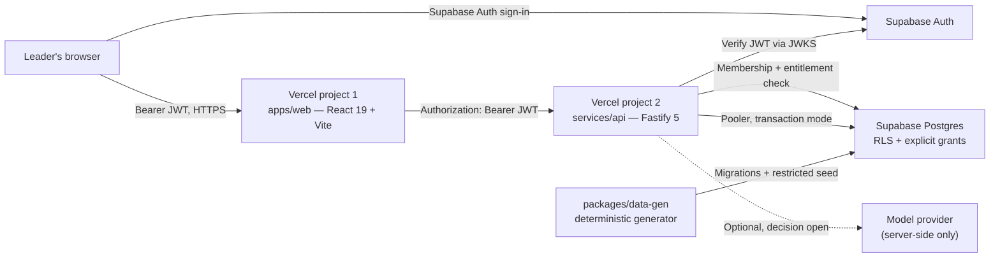
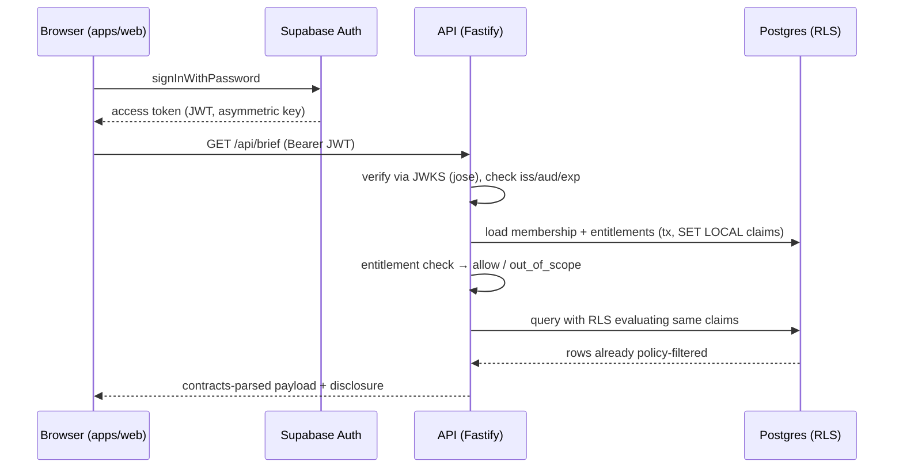

# Orbit — Architecture and Folder Layout

**Status:** Proposed architecture for the confirmed decisions; reviewed against vendor documentation on 22 September 2026. Nothing in this document is implemented yet.<br>
**Related documents:** [PRD](PRD.md) · [Four-person assignments](TEAM_ASSIGNMENTS.md).<br>
**Owners:** Aditya (integration/security), Maruti (data), Ghansham (backend), Ayas (frontend).

## 1. Purpose and reading guide

This document defines the new Orbit monorepo: folder layout, frontend and backend architecture, Supabase data/auth design, the two-Vercel-project deployment, and the constraints each choice imposes. It also records what we reuse from the two existing codebases and what we reject, with reasons.

Sections marked **Confirmed** reflect Aditya's decisions. Everything else is **Proposed** until the owning person implements it and Aditya reviews the boundary. Where vendor behavior matters (Vercel function limits, Supabase RLS semantics), the claim is cited in [§18](#18-sources-and-verification-limits).

## 2. System overview



One frontend project, one backend project, one Supabase project (plus a separate Supabase project for previews/test — see [§11](#11-deployment-two-vercel-projects)). The browser never talks to the database directly. The backend is the only path to business data, and it enforces authorization on every request; RLS is the second barrier inside the database. [E1, S5]

This is a hosted fictional-data prototype, not the pitch’s client-bound deployment. There is no ingress tokenization layer, sealed raw-record vault, client-jurisdiction guarantee, or claim that identity “never leaves the building.” The dataset intentionally contains no patient or employee identity. Aditya must align this boundary with the buyer before the first external demo.

## 3. Confirmed technology decisions

| Concern | Decision | Source |
|---|---|---|
| Product scope | All 14 role dashboards, 4 surfaces each | Confirmed by Aditya; workbook [W2] |
| Repository | New Orbit monorepo, selective reviewed reuse | Confirmed by Aditya |
| Database + Auth | Supabase Postgres + Supabase Auth | Confirmed by Aditya |
| Hosting | Two separate Vercel projects (web, api) | Confirmed by Aditya |
| Future | AWS migration path preserved, not built | Confirmed by Aditya |
| Data | Fictional company, coherent synthetic data (Maruti) | Confirmed by Aditya |
| Node | 22 LTS | Legacy pin; supported on Vercel as `22.x` [V5] |
| Language | TypeScript `strict` everywhere | Carried from legacy rules |
| Frontend | React 19 + Vite, react-router 7 | Carried from legacy rules; Vite is a static SPA on Vercel |
| Backend | Fastify 5 + TypeScript | Carried; officially supported as a zero-config Vercel backend [V1] |
| Validation | Zod 4, shared contracts package | Carried from legacy rules |
| Tests | Vitest for units/contracts; Vitest Browser Mode where useful; Playwright + axe smoke; pgTAP via `supabase test db` for RLS | Browser and database testing are additive gates, not a second application framework [S2, T1, T2] |

**Superseded for Orbit (kept only as history in the old repo):** no-database Phase 1, custom HS256 JWT auth via `jose` with a dev secret, seven fixed local ports, two-role scope, four separate apps. The old repo's ports and bootstrap services do not carry over.

**Deliberately not added:** Next.js, Express/Nest, an ORM (Prisma/Drizzle), Docker as a pinned project dependency (it is optional for local Supabase CLI use), a state-management library, a styled component library, Storybook/Turborepo/Nx, Cypress, or any auth SaaS beyond Supabase Auth. Selective unstyled Radix Primitives may be wrapped in `packages/ui-kit` when a dialog, popover, tabs, or focus behavior materially improves accessibility; Radix is not a visual system and is not a blanket dependency. TanStack Query, TanStack Table, React Hook Form, and React Aria remain deferred until a measured product need appears. If someone believes one of these decisions is wrong, raise it with Aditya and change it here first — not in one workspace.

## 4. Monorepo layout

Proposed root `orbit/` (new repository; do not push into the existing one):

```
orbit/
  package.json                  # npm workspaces, Node "22.x", root scripts
  tsconfig.base.json
  .env.example                  # every var documented; .env gitignored
  apps/
    web/                        # Vercel project 1 — the only frontend
      vercel.json               # SPA rewrites; relatedProjects for preview API URL
      src/
        main.tsx
        router.tsx              # react-router v7 declarative
        lib/                    # api client (fetch + contracts parse), auth client
        features/
          brief/  inbox/  explorer/  ask/  actions/  audit/
        roles/                  # one folder per role: view config, not per-role apps
          chairman/  clinical-director/  regional-coo/  hospital-dho/
          people-executive/  bd-lead/  billing-lead/  coe-lead/
          corporate-revenue-lead/  group-cfo/  procurement-head/
          hr-head/  legal-head/  analytics-head/
  services/
    api/                        # Vercel project 2 — the only backend
      vercel.json
      src/
        app.ts                  # Vercel-detected Fastify entrypoint [V1]
        plugins/
          auth.ts               # JWKS verify (jose) + membership loader
          scope.ts              # entitlement enforcement helpers
          errors.ts             # typed errors incl. out_of_scope
        modules/
          brief/  inbox/  kpi/  ask/  actions/  audit/
        db/
          client.ts             # postgres.js, pooler transaction mode
          rls.ts                # per-transaction claim GUC helper
  packages/
    contracts/                  # Zod schemas + inferred types for every API payload
    ui-kit/                     # tokens, .is-illustrative, chart wrappers (Recharts ONLY here)
    kpi-framework/              # typed, versioned import of the workbook:
                                # 14 roles, 29 definition families, 109 assignments
    data-gen/                   # Maruti's generator + invariant checks (deterministic)
  supabase/
    migrations/                 # SQL; grants + RLS in the same migration as each table
    tests/                      # pgTAP RLS tests, run with `supabase test db`
    seed/                       # environment-restricted loader (see §7.5)
  data/
    snapshots/                  # generated JSON + manifest + checksum for review/diff
  docs/
    orbit/                      # PRD, architecture, assignments
    decisions/                  # short ADRs for each open decision once resolved
```

Rules that come with this layout:

- **One frontend, one backend.** Fourteen roles are `apps/web/src/roles/*` view configurations over shared features — not 14 apps, not 14 deployments.
- **`packages/contracts` is the only place a cross-boundary shape is defined.** Producers parse before sending; consumers parse on arrival. Never `as KpiListResponse`. Need a field? PR to contracts, review from the boundary owner.
- **`packages/kpi-framework` is generated from the workbook, not hand-copied.** A generator/import script with a checksum; the 29-vs-30 family count and every row mapping are verified by tests.
- **Recharts is imported only inside `packages/ui-kit`.** Apps use the wrappers.
- **No `VITE_` secret exists.** If a value must stay secret, it lives only in the backend project's env. [S6]

## 5. Frontend architecture (Ayas)

**Shape:** React 19 SPA built by Vite, deployed as static assets on Vercel project 1. No SSR/SEO need — it is an authenticated internal tool.

- **Routing:** React Router v7 data-router APIs in SPA mode (loaders, actions, fetchers, pending UI, error boundaries, and mutation revalidation; no framework mode or SSR). Routes: `/login`, `/` (brief), `/inbox`, `/explorer`, `/ask`, `/actions`, `/audit` (permission-gated). Role selects the view config, never the data scope.
- **Auth client:** `@supabase/supabase-js` with `VITE_SUPABASE_URL` + `VITE_SUPABASE_PUBLISHABLE_KEY` (publishable key is safe to expose; it is not a secret). Sign-in via `signInWithPassword`; sessions for provisioned accounts only — no signup UI.
- **API client:** one `lib/api.ts` that attaches the current access token, parses every response with the contracts schema, and maps failures to typed UI states (loading, empty, forbidden, out_of_scope, stale, unavailable). No component calls `fetch` directly.
- **State:** route loaders/fetchers own server-data lifecycle and React state owns local presentation state. No Redux/Zustand or client cache library in the first vertical slice. On sign-out or token change, all protected query state is cleared (PRD FR-01). Reconsider TanStack Query only after profiling shows a real cache/refetch problem.
- **Role views:** `roles/<role>/view.config.ts` declares the KPI layout, emphasis, and which shared feature components render. Configuration is data-driven from the framework package — no hard-coded KPI names, targets, or facility names in components.
- **Disclosure:** `.is-illustrative` / `.chip-illustrative` from ui-kit wrap every number surface; the brief renders the `disclosure` string returned by the API. This is governance, not styling, and is never removed for screenshots.
- **Design:** tokens and type from ui-kit only; no hard-coded hexes; distinct role layouts (not 14 identical card grids); no library-default charts. The existing `docs/design-guidelines.md` bans carry over.
- **Accessibility primitives:** use native HTML first. When native elements are insufficient, use only the approved, selectively adopted Radix primitive wrapped and styled by `packages/ui-kit`; test focus return, keyboard interaction, labels, and escape behavior. Do not expose Radix defaults or add a second accessibility abstraction.
- **Testing:** Vitest unit/contract tests per feature and Vitest Browser Mode for critical focus/keyboard behavior where practical; one route-level test per role asserting its full KPI set renders from contract-valid fixtures; forbidden/out-of-scope states tested, not just happy paths. A small Playwright + `@axe-core/playwright` smoke suite covers the Regional COO journey and 390px/768px/desktop layouts. Automated axe checks supplement, rather than replace, manual keyboard review.
- **Decision-first UX:** the brief and inbox are the default work surfaces. Act now / Monitor / On track sections, guided Ask prompts, and structured Evidence Cards are shared components; role configs supply the authorized KPI/scenario content.
- **Responsive behavior:** test the brief and inbox at 390px, 768px, and desktop widths. Small-screen layouts may simplify dense explorer tables, but must preserve the evidence and action path. Do not assume leaders only use a 27-inch monitor.

## 6. Backend architecture (Ghansham)

**Shape:** Fastify 5 + TypeScript as a single Vercel Function (Fluid compute) on project 2. Entrypoint at `src/app.ts` so Vercel detects it with zero config. [V1, V2]

### 6.1 Request pipeline

Every route passes through, in order:

1. **Auth plugin** — extract `Authorization: Bearer`; verify the JWT signature against the project's JWKS (`https://<ref>.supabase.co/auth/v1/.well-known/jwks.json`) using `jose`'s `createRemoteJWKSet`; validate `iss`, `aud`, `exp`. Supabase documents exactly this pattern for non-supabase-js servers. [S4] If the project were on a legacy symmetric (HS256) key, the JWKS endpoint is empty — then fall back to calling `/auth/v1/user`; new projects default to asymmetric keys, and we keep that. [S4]
2. **Membership loader** — resolve the token subject to exactly one active membership row (role, organization, scope entities). Missing, inactive, or ambiguous membership → 403. Role comes **only** from this trusted record, never from a request field or UI claim.
3. **Scope plugin** — the module asks "may membership X read metric Y at grain Z?" against the entitlement matrix ([§8](#8-identity-and-authorization)). Deny by default; answer `out_of_scope` plainly rather than silently narrowing. [E1]
4. **Handler** — validates input with contracts, runs the query through the db layer with RLS claims set, parses output with contracts.
5. **Errors** — typed error map; no stack traces or secrets in responses.

### 6.2 Modules

`brief`, `inbox`, `kpi`, `ask`, `actions`, `audit` — one folder each, owning its routes, queries, and tests. Modules never reach into each other's SQL; shared reads go through the db layer.

### 6.3 Database access

- Driver: `postgres.js` (or equivalent thin driver — no ORM), connecting through the **Supavisor transaction-mode pooler** (`…pooler.supabase.com:6543`), the documented mode for serverless functions. Prepared statements off (transaction mode does not support them). [S3]
- The API connects as a dedicated least-privilege role `orbit_app` — **not** `postgres`, **not** `service_role` (service role bypasses RLS). [S2]
- Each request opens a transaction and `SET LOCAL`s the verified membership claims (see §8.3), so RLS policies evaluate per user. Transaction mode makes `SET LOCAL` safe; session-scoped `SET` would leak across pooled clients and is banned.
- Connections are per-invocation and closed; no in-process cache of protected data across requests (serverless instances are ephemeral and shared state is unreliable). [V2]
- Keep the whole app inside the 250 MB function bundle limit and responses under the 4.5 MB body limit — paginate explorer/audit endpoints accordingly. [V4]
- A `/health` route is the only unauthenticated endpoint. Cron, if ever needed, uses Vercel Cron with a `CRON_SECRET` Bearer check. [V2]

Before all modules are implemented, prove one vertical slice: a Regional COO request authenticated by Supabase, scoped through membership and RLS, returned through contracts, rendered by the frontend, and denied for another region. This is the integration proof for the rest of the role configurations.

## 7. Data architecture (Maruti)

### 7.1 Schema groups

All tables live in a non-exposed internal schema (e.g. `core`), plus a thin exposed surface only if needed. Grouped:

- **Framework:** `roles`, `kpi_definitions` (29 families, versioned), `role_kpi_assignments` (109 rows, weights per role sum to 100), `governance_rules`, `definition_components` (decomposing bundled KPIs; unresolved mappings flagged, never faked).
- **Organization:** `organizations`, `regions`, `facilities`, `coes`, `org_memberships` (user ↔ role ↔ org ↔ scope), `entitlements` (role × metric × grain × action).
- **Facts:** underlying synthetic facts (financial lines, billing/claims movements, capacity snapshots, workforce events, pipeline events, supplier events, legal/governance actions) — generated first, KPI components derived from them (PRD §8.2).
- **Derived:** `kpi_observations` (component or computed value, period, entity, numerator/denominator links, definition version, unit, provenance, data-quality state, reconciliation status, simulated refreshed-at).
- **Workflow:** `actions` (with optimistic-lock version, idempotency key), `action_events`, `audit_events`.
- **Evidence:** `evidence_links` joining brief/inbox/ask answers to observation IDs + definition versions.

### 7.2 RLS and grants — non-negotiables

Per Supabase's own guidance, for every table: [S2, S5]

1. `enable row level security` in the same migration that creates the table.
2. Revoke default privileges so new objects are not auto-granted to `anon`/`authenticated`/`service_role`.
3. Grant each role only what it needs (`orbit_app`: exactly the CRUD it uses; audit table is INSERT + controlled SELECT only — no UPDATE/DELETE grant to anyone).
4. One policy per operation (`select`, `insert`, …) — no `for all`.
5. A pgTAP test file per table asserting allow **and** deny for each role; `supabase test db` in CI. [S2]
6. No views over protected tables unless created with `security_invoker` — default views run as owner and bypass RLS. [S2]
7. Multiple permissive policies OR together — write each one assuming the others exist. [S2]
8. Treat aggregate exposure as a permission: group totals can let a user infer a restricted peer (documented failure mode in Power BI RLS guidance). Entitlements must state which aggregates/breakdowns each role may see. [E5]

### 7.3 Data API posture

Recommended and proposed: **disable the Supabase Data API** for the project, because the browser never queries tables directly — all reads/writes go through the Fastify backend over a Postgres connection. Supabase documents this as a supported hardening step. [S5] If we later need it, grants + RLS above already assume the strict posture. A future ADR may compare a user-scoped Data API path against direct Postgres for operational simplicity; that evaluation must not weaken the current backend authorization boundary or AWS portability requirement.

### 7.4 Synthetic data generation

`packages/data-gen` is deterministic (fixed seed), generates underlying facts first and derives KPI components, and emits: SQL seed files for `supabase/seed/`, review JSON snapshots in `data/snapshots/`, and a manifest with checksum, definition versions, and scenario labels. Invariant checks (reconciliation, ratio roll-ups, missing≠zero, weight sums, cross-entity consistency, tenant fixtures) run in CI. Full data brief: PRD §8.

### 7.5 Seeding discipline

Seed/reset runs from a developer machine or CI with an environment-restricted script using a **separate** seeder role — never from the deployed API, never with a credential committed to the repo. Reset is an explicit command (`npm run data:reset`), separate from idempotent `data:seed`. The hard-coded service-role credential found in the old remote repo is the anti-pattern this replaces — see §12.

## 8. Identity and authorization

### 8.1 Flow



- `getSession()` on the client is used only to obtain the token to send; its embedded user object is never trusted for authorization — this matches Supabase's own guidance. [S4]
- Backend verification uses JWKS via `jose` (the documented server pattern); `supabase.auth.getClaims()` is the equivalent inside Supabase's own runtimes. Either way: signature verified every request. [S4]
- Deny by default, check every request, no hierarchy cascade — the Chairman does not inherit others' scopes; per-role KPI sets define visibility. [E1, R1]

### 8.2 Entitlement matrix

A reviewed table (in `packages/kpi-framework` + `entitlements` rows) answering, per role: which of the 109 assignments it sees, at which grains (group/region/facility/COE/segment), which breakdowns, which evidence fields, which actions it may create/be assigned, and audit access. Aditya owns this matrix; Maruti and Ghansham review it. It is seeded data with tests, not code scattered in handlers.

### 8.3 RLS claims handoff

The API sets, per transaction: `SET LOCAL orbit.membership = '<json of verified claims>'`. Policies reference `current_setting('orbit.membership', true)::jsonb`. Missing/invalid claims → policies evaluate to no rows (the "unexpected value returns nothing" pattern). [E5]

## 9. Governed Ask architecture

- **Server-side only.** No `VITE_*` model key ever exists; the old remote app's browser-side Gemini SDK pattern is explicitly rejected (§12). [S6]
- **Authorization first, model second.** The ask module resolves the question to a typed query from a reviewed catalogue, runs it through the same scope/RLS path as every other read, and only then summarizes the authorized evidence. A prompt can never widen scope. [E3]
- **v1 baseline (no provider decision needed):** deterministic catalogue — definition lookup, period performance, compatible comparisons, contributor breakdown, exception/action summaries — rendered from typed evidence templates with scope/period/limitations attached. Honestly labeled as a guided assistant.
- **Guided prompts and Evidence Cards:** expose three or more authorized prompt suggestions per role and render every answer as Answer → Relevant records → Definition/policy basis → Evidence reasoning → Possible next action → Scope/period/limitations. This restores the pitch’s governed reasoning experience without inventing confidence scores or policy citations.
- **Optional model adapter (open decision):** if Aditya approves provider/cost/egress, a thin adapter maps free text to the same catalogue intents and summarizes permitted evidence. It cannot emit SQL, cannot call actions, and its input is already-scoped data. Provider key lives only in the backend env; timeouts must stay well under the function duration limit (300s Hobby / 800s Pro max), with streaming if long answers are needed. [V4, V2]
- **Never:** invented numbers, invented policy citations, or fabricated confidence percentages (all three were found in the old remote app — §12).

## 10. Actions and audit

- **Actions:** internal-only workflow (PRD FR-06). Table enforces allowed state transitions; optimistic locking via a version column; idempotency key on creation so retries don't duplicate; assignee permission checked so assignment can't leak evidence.
- **Atomicity:** action mutation + its `action_events` + `audit_events` rows commit in one transaction.
- **Audit:** persistent, append-only (INSERT-only grant), role-gated SELECT, records accepted actions, Ask outcomes, denials, and evidence access — without secrets or unnecessary raw prompt text. This is an application-protected trail, not a claim of immutable storage. [E2]
- Durability comes from Postgres, which also removes the old Phase 1 in-memory audit caveat.

## 11. Deployment: two Vercel projects

Confirmed: frontend and backend are **separate Vercel projects on separate domains**, backed by one Git monorepo. This is a documented Vercel pattern. [V3]

### 11.1 Project setup

- **Project 1 (web):** root directory `apps/web`, framework Vite, Node `22.x` via `engines`. SPA rewrite to `index.html` in its `vercel.json`.
- **Project 2 (api):** root directory `services/api`, Fastify zero-config detection (entrypoint `src/app.ts`), Node `22.x`.
- Both projects connect to the same repo; Vercel can **skip unaffected builds** when workspace dependency graphs are explicit (unique package names, declared deps, npm workspaces) — our layout satisfies this; verify the toggle is on. [V3]
- **Preview wiring:** declare the API as a **Related Project** of the web project so preview deployments receive the matching API URL automatically instead of hand-editing env per preview (max 3 linked projects; Git-connected deploys only). [V3]
- **Environments:** production pair (web-prod, api-prod) + preview deployments per PR. Supabase side: separate dev/preview project from prod so seeds and experiments never touch the production dataset.

### 11.2 Environment variables

| Project | Variable | Visibility |
|---|---|---|
| web | `VITE_SUPABASE_URL`, `VITE_SUPABASE_PUBLISHABLE_KEY` | public by design (bundled) [S6] |
| web | `VITE_API_BASE_URL` | public; from Related Projects in previews |
| api | `SUPABASE_URL`, `SUPABASE_PUBLISHABLE_KEY` | server-only |
| api | `SUPABASE_JWKS_URL` (or derived from URL) | server-only |
| api | `DATABASE_URL` (pooler transaction mode, `orbit_app`) | server-only secret |
| api | `ALLOWED_ORIGINS` (exact web origins) | server-only |
| api | `MODEL_PROVIDER_*` (only if Ask adapter approved) | server-only secret |

**Never** in the web project: database URL, secret/service keys, model keys. Anything `VITE_` is public — Vite inlines it into the bundle. [S6]

### 11.3 CORS and auth redirects (Aditya)

- Separate domains mean cross-origin calls: the API sets CORS with an **exact origin allowlist** from `ALLOWED_ORIGINS` (production domain + the team's preview wildcard decided by Aditya), allowed headers including `Authorization`, and explicit denial otherwise. No `*` with credentials.
- Supabase Auth URL configuration: Site URL = production web origin; Redirect URLs include `http://localhost:5173/**` and the documented Vercel preview wildcard pattern (`https://*-.vercel.app/**` per Supabase's Vercel guidance). [S7]

### 11.4 Known Vercel limits we design around [V4]

- Function body limit 4.5 MB → paginate; no workbook-sized responses.
- Duration 300s (Hobby) / 800s (Pro) → Ask timeouts below that; stream long answers.
- Ephemeral, concurrent instances → no in-memory sessions, no in-process protected caches, no local-file state; Postgres holds actions/audit.
- 1,024 file descriptors shared per instance → pooled, closed DB connections only.
- Single region by default → pick the Vercel region near the Supabase project region; both recorded in env/docs. Multi-region is a paid-tier decision for later, not v1.

## 11.5 Delivery and local development strategy

The final product still covers all 14 roles, but implementation is parallel:

- Maruti can import the workbook and build the synthetic fact model locally without waiting for Vercel or a live Supabase project.
- Ghansham can build the Fastify pipeline and authorization tests against contract fixtures and a local/test database boundary. `supabase start` requires a Docker-compatible container runtime; Docker is not a framework replacement and is not a pinned developer prerequisite. The default MVP path is contract fixtures plus a dedicated hosted dev/preview Supabase project, with migrations applied by `supabase link`/`supabase db push`. Developers who need a fully local Supabase stack may use Docker Desktop, Podman, Rancher Desktop, OrbStack, or another approved compatible runtime.
- Ayas can build tokens, shell, guided prompts, and role configurations against contract fixtures without waiting for Maruti’s final seed.
- Aditya’s urgent first task remains credential remediation; cloud project wiring can proceed in parallel with local/mock work. The hosted/fixture path is the supported MVP workflow: it avoids making a container runtime a prerequisite while retaining real Supabase integration in a shared non-production boundary. Local `supabase test db` and database resets remain available in CI or on machines with an approved container runtime; an equivalent isolated remote RLS test boundary must be used when local containers are unavailable. Fixtures do not replace authorization tests.

The workbook fixes the framework package shape, but it does **not** by itself freeze every API response shape. `packages/contracts` can be drafted immediately from the workbook and UX needs, then frozen after Ghansham and Ayas review the actual payloads.

## 12. Reviewed reuse and rejection

Two existing codebases were inspected (local `main` `63f0fcb`; remote `origin/main` `81cc292`). They share no Git ancestor — **no wholesale merge**. Copy reviewed pieces into the new repo.

### 12.1 Reuse from the local repo (verified by inspection)

| Asset | Verdict | Notes |
|---|---|---|
| Contracts discipline (Zod schemas + inferred types, parse-at-boundary) | **Reuse pattern, rewrite content** | New Orbit schemas; the discipline is proven |
| UI-kit token structure, `.is-illustrative` / `.chip-illustrative` | **Reuse** | Governance disclosure depends on it |
| Deterministic generator + invariant-verifier approach | **Reuse pattern** | Extend from 16 KPIs/2 roles to 109 assignments/14 roles |
| Role-scoping model (no cascade, no impersonation, `out_of_scope`) | **Reuse as policy** | Lives in entitlements + tests now |
| Design guidelines (bans, token rule) | **Reuse as policy** | Applies to Ayas unchanged |
| Existing 4 apps, 3 bootstrap services, 2-role dataset | **Reject** | Scaffolds and wrong-scope data |

### 12.2 Reuse from the remote repo (verified by inspection)

| Asset | Verdict | Notes |
|---|---|---|
| Single-app layout instinct, some screen composition ideas | **Reuse selectively** | Reviewed by Ayas; tokens, not its palette |
| Supabase migration skeleton (roles/definitions/assignments/values tables) | **Reuse as reference only** | Rewrite with §7.2 grants/RLS discipline |
| Login page | **Reject** | Accepts any well-formed email + 6-char password; not Supabase-verified |
| `USING(true)` RLS policies on all six tables | **Reject** | Broadly readable — the exact failure §7.2 exists to prevent |
| Hard-coded service-role credential in `scripts/seed_supabase.mjs` | **Reject + urgent remediation** | Must be revoked/rotated (Aditya+Maruti); never copied |
| Browser-side `@google/genai` with `VITE_GEMINI_API_KEY` | **Reject** | Key would be public in the bundle; Ask is server-side [S6] |
| Offline answer inventing "+2.9% revenue", fake policy citation, confidence 100 | **Reject** | PRD FR-05 bans all three behaviors |
| Random 85–100 targets, one-month seed, free-text facility scope | **Reject** | Replaced by coherent generator + typed scope |
| Mock-data context, local-state actions, session-only audit | **Reject** | Replaced by Postgres-backed actions/audit |
| `getSessionProfile.ts` (unwired), 8-role type list | **Reject** | 14 roles; real membership table |

## 13. AWS portability path (future, not built)

The confirmed future option stays cheap because of choices made now:

- The backend is plain Fastify/Node: on AWS it runs as a container (ECS/App Runner) or via a Lambda adapter with no framework change. Keep `vercel.json` thin; isolate Vercel-only env names behind a config module.
- Database access sits behind `db/client.ts`; moving Supabase Postgres → RDS/Aurora is `pg_dump`/restore + a connection-string change (pooler swap documented by Supabase). [S3]
- JWT verification via JWKS works from any host; if auth ever moves off Supabase, only the auth plugin changes.
- Avoid Vercel-only features in business logic (Cron, Related Projects, Fluid-only APIs); if used operationally, record the AWS equivalent (EventBridge, SSM params) in an ADR when adopted.
- Supabase Auth migration would be a deliberate future decision (user export, password-hash constraints) — flagged now so nobody assumes it's trivial.

## 14. Platform limits and operational constraints checklist

| Constraint | Source | Design response |
|---|---|---|
| Function bundle ≤ 250 MB | [V4] | Thin deps; no ORM; measure in CI |
| Body ≤ 4.5 MB | [V4] | Pagination, no bulk exports v1 |
| Duration 300s/800s max | [V4] | Ask timeouts; streaming; no long jobs in-request |
| Ephemeral instances | [V2] | All state in Postgres |
| Pooler transaction mode: no prepared statements | [S3] | Driver configured accordingly |
| Service role bypasses RLS | [S2] | Never used by the API; seeder role separate |
| Permissive policies OR together | [S2] | Per-operation policies + deny tests |
| `VITE_*` is public | [S6] | No secrets in web env, enforced by review + CI scan |
| Related Projects ≤ 3, Git-deploys only | [V3] | Fits our 2-project topology |
| Local Supabase requires a container runtime | [S1] | Hosted fixtures/dev project is the default MVP path; local containers remain optional |

## 15. Testing and quality gates

- **Contracts:** schema round-trip tests; every API route has a contract test.
- **Backend:** module unit tests + integration tests against an approved Supabase test boundary with seeded fixtures (local CLI when Docker is available, otherwise a dedicated remote project); authorization matrix tested positive and negative per role.
- **Data:** generator invariants in CI; pgTAP through a Docker-backed Supabase CLI environment or an equivalent approved RLS test boundary for every table's allow/deny cases. [S2]
- **Frontend:** per-feature unit/contract tests; Vitest Browser Mode for critical focus/keyboard behavior where practical; per-role route tests from fixtures; forbidden/stale/missing-target states.
- **E2E smoke (post-deploy):** a small Playwright suite signs in on the real web origin → loads the brief → probes out-of-scope data → records an action → verifies persistence after refresh, with 390px, 768px, and desktop viewport checks. `@axe-core/playwright` runs on the core journey. Manual keyboard review remains required; axe does not prove complete accessibility.
- **Root gates before any push:** `npm run typecheck && npm run test && npm run lint` plus data/RLS suites. Typecheck passing = no two workspaces disagree on a contract.

## 16. Security controls checklist (first release)

- [ ] Exposed service-role credential from old repo revoked/rotated; history scrub decision recorded (Aditya + Maruti)
- [ ] JWKS verification on every API request; membership from DB, never from request [S4, E1]
- [ ] RLS enabled + grants minimal + pgTAP deny tests on every table [S2]
- [ ] Data API disabled or equivalently locked [S5]
- [ ] CORS exact-origin allowlist; unapproved origins fail preflight
- [ ] No secrets in `VITE_*`, repo, logs, or audit rows [S6, E2]
- [ ] Audit INSERT-only; select gated; survives redeploy [E2]
- [ ] Ask cannot exceed caller scope; no arbitrary SQL; prompt-injection treated as untrusted input [E3]
- [ ] Seed/reset environment-restricted; demo credentials provisioned securely, never committed
- [ ] Dependency + secret scanning in CI; `.env.example` current

## 17. Open decisions (gates, not blockers for documentation)

1. Ask provider/cost/egress — Aditya with Ghansham (v1 ships deterministic catalogue regardless).
2. Entitlement matrix sign-off — Aditya, drafted by Maruti/Ghansham.
3. Action transition matrix — Aditya.
4. Domains, regions, Vercel/Supabase plan tiers, preview wildcard policy — Aditya.
5. Performance envelope and measurement method — Aditya (PRD §9 proposed targets).
6. Real-data pilot (jurisdiction, residency, vendor agreements, clinical validation) — business/legal/security owners not yet named.

## 18. Sources and verification limits

### Vendor documentation (consulted 22 September 2026)

- **V1:** [Fastify on Vercel](https://vercel.com/docs/frameworks/backend/fastify) — zero-config, single Function, entrypoint names, Fluid compute.
- **V2:** [Backends on Vercel](https://vercel.com/docs/frameworks/backend) and [ship a Fastify app](https://vercel.com/kb/guide/ship-a-fastify-app-on-vercel) — ephemeral model, cron, streaming, `vercel dev`.
- **V3:** [Using Monorepos](https://vercel.com/docs/monorepos) and [structure your application](https://vercel.com/kb/guide/structure-your-application) — separate projects, skip-unaffected-builds requirements, Related Projects, CORS trade-off of separate domains.
- **V4:** [Vercel Functions limits](https://vercel.com/docs/functions/limitations) — 250 MB bundle, 4.5 MB body, 300s/800s durations, 1,024 descriptors, regions.
- **V5:** [Supported Node.js versions](https://vercel.com/docs/functions/runtimes/node-js/node-js-versions) — 22.x available, pin via `engines`.
- **S2:** [Supabase RLS guide](https://supabase.com/docs/guides/database/postgres/row-level-security) — grants+policies, revoking defaults, per-operation policies, views, `supabase test db`; [PostgreSQL RLS docs](https://www.postgresql.org/docs/current/ddl-rowsecurity.html) — owner/BYPASSRLS behavior.
- **S3:** [Connecting to Postgres](https://supabase.com/docs/guides/database/connecting-to-postgres) — direct vs pooler, transaction mode for serverless, prepared-statement caveat.
- **S4:** [Supabase JWT guide](https://supabase.com/docs/guides/auth/jwts) and [creating a server client](https://supabase.com/docs/guides/auth/server-side/creating-a-client) — JWKS + `jose` verification, `getClaims`/`getUser`/`getSession` semantics, asymmetric-key default.
- **S5:** [Securing your API](https://supabase.com/docs/guides/api/securing-your-api) — explicit grants, revoke defaults, disable Data API.
- **S6:** [Vite env and modes](https://vite.dev/guide/env-and-mode) — `VITE_*` is bundled/public.
- **S7:** [Supabase redirect URLs](https://supabase.com/docs/guides/auth/redirect-urls) — Vercel preview wildcard pattern.
- **S1:** [Supabase local development](https://supabase.com/docs/guides/local-development) and [CLI getting started](https://supabase.com/docs/guides/cli/getting-started) — `supabase start` uses a Docker-compatible container runtime; migrations can target linked remote projects.
- **T1:** [React Router `createBrowserRouter`](https://reactrouter.com/api/data-routers/createBrowserRouter), [Data Mode route objects](https://reactrouter.com/start/data/route-object), and [mode guidance](https://reactrouter.com/main/start/modes) — loaders/actions/fetchers, pending states, and revalidation without Framework Mode or SSR.
- **T2:** [Radix Primitives introduction](https://www.radix-ui.com/primitives/docs/overview/introduction), [accessibility](https://www.radix-ui.com/primitives/docs/overview/accessibility), [Playwright accessibility testing](https://playwright.dev/docs/accessibility-testing), and [Vitest Browser Mode](https://vitest.dev/guide/browser/) — selective accessible primitives and browser-quality gates.
- **E1/E2/E3/E5:** OWASP Authorization, Logging, LLM Prompt Injection; Power BI RLS guidance (URLs in [PRD sources](PRD.md#sources-and-verification-limits)).
- **R1/R2:** Existing repo rules and the two inspected code snapshots (commit IDs in §12).

**Verified against vendor docs:** Fastify-on-Vercel support and limits; monorepo multi-project model; Supabase JWT/RLS/pooler semantics and container requirement for the local CLI; Vite public-env behavior; React Router data APIs; Radix accessibility primitives; Playwright accessibility checks; Vitest Browser Mode.<br>
**Not yet verified:** this architecture as running software — no project, database, or deployment exists yet. Every boundary here is proposed until the integration tests in §15 pass.
