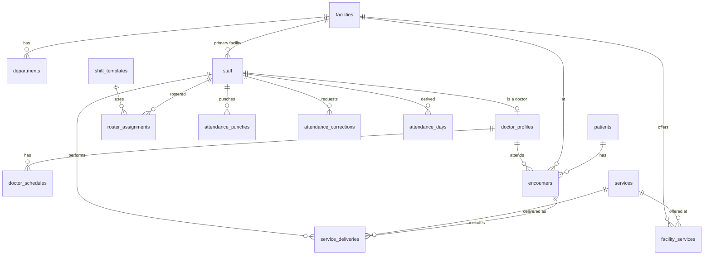

# Orbit — Hospital Operations (ERP) Module: Implementation Plan

**Status:** Proposed plan; **implemented on a branch at the product owner's request, pending sign-off.** [ADR 0016](../decisions/0016-erp-module-and-operator-roles.md) records what was built and where it departs from this plan. The main departures:
- two operator roles, `admin` and `hospital`, instead of the four in §4.1;
- attendance derived on read rather than stored;
- a separate ERP audit table;
- no seeded tariffs.

Everything in ADR 0016 still needs the sign-offs listed there before merge.<br>
**As of:** 30 September 2026 (`main` at `542d312`); implementation status updated 1 October 2026.<br>
**Author:** Ghansham (drafted with an AI assistant; every table, field, and endpoint below is a proposal, not a verified design).<br>
**Related documents:** [PRD](PRD.md) · [Architecture](ARCHITECTURE.md) · [Team assignments](TEAM_ASSIGNMENTS.md) · [File structure](FILE_STRUCTURE.md) · [Rules](../../RULES.md) · [Decisions](../decisions/).

---

## 1. Summary

The request is to add a hospital operations (ERP) module to Orbit that keeps:

1. **Patient details:** registration and visits (encounters).
2. **Doctor details:** profile, specialty, facility assignment, credentials, and consultation schedule.
3. **Worker (staff) details:** profile, department, rosters, and **in/out attendance times**.
4. **Services provided by the hospital:** a service catalogue per facility, and a record of which service was delivered to which patient, by whom, and when.

Orbit today is a *leadership decision workspace* built on aggregate synthetic data. This module would make it hold **individual-level records** for the first time. The plan therefore:

- keeps every record **synthetic and visibly illustrative**, with no real patient or employee data under any circumstance (RULES.md "Never");
- stores ERP records in a **separate database schema** with its own grants, so the existing leadership data path is untouched;
- reuses the existing stack and patterns: Supabase Postgres + RLS, Fastify module ports, Zod contracts, the React Router data router, native HTML forms, the deterministic data generator, and the actions approval flow. It adds **no new dependency**;
- builds in the order of lowest to highest sensitivity: **staff and attendance → doctors → service catalogue → patients, encounters, and service delivery → KPI integration**;
- feeds leadership dashboards only through **aggregates**, never raw records. Existing KPIs (roster adherence, fill rate, capacity utilisation, throughput) can later be derived from ERP facts once Maruti defines the derivations.

---

## 2. This is a scope change: decisions needed first

The current specifications explicitly exclude this kind of data. The plan must not start until the conflicts below are resolved in writing.

| Current rule | Where | Conflict with this plan |
|---|---|---|
| "Orbit v1 uses a fictional aggregate dataset with **no patient or employee identity**." | PRD §1.1, ARCHITECTURE §2 | ERP records are individual-level by nature. |
| Not included: "A **system-of-record replacement** for those [HIS/EMR, HR] systems." | PRD §5.2 | A patient/staff/attendance register is a system of record. |
| Not included: "Real patient, employee, payer, or client operational data." | PRD §5.2, RULES.md | Unchanged. This plan keeps it. Synthetic only. |
| People Executive sees "aggregated personnel measures rather than individual employee records." | PRD §4 | Staff directory access must be decided per role. |
| Chairman: "Group aggregates do not confer unrestricted access to hospital, clinical, or personnel records." Clinical Director: "No patient-level access is required." | PRD §4 | Leaders get no patient-level access by default in this plan. |
| Preserve all 14 roles. | AGENTS.md | ERP operators (front desk, HR admin) are not among the 14 workbook roles. See D2. |

### 2.1 Decisions required (each one gates a phase)

| # | Decision | Owner | Recommendation in this plan | Blocks |
|---|---|---|---|---|
| D1 | Is the ERP module in scope, and as what: a **synthetic demo module inside Orbit**, a separate product, or not at all? Record as **ADR 0016** and amend PRD §5.2. | Aditya | Synthetic demo module in the same monorepo, separate schema (Option A, §2.2). | Everything |
| D2 | How are ERP operator users (front desk, HR admin, facility admin) represented without breaking the 14-role invariant? | Aditya, Ghansham, Maruti | Add a membership *kind* (`leader` / `operator`) and a separate operator-role list, not new workbook roles (§6.1). Record as **ADR 0017**. | Phase 1 |
| D3 | The exact field list for patient, doctor, and staff records (data minimization). | Aditya, Maruti | The minimal lists in §5. No diagnosis, clinical notes, prescriptions, contact details, or government ID numbers. | Phase 1 |
| D4 | Attendance rules: shift definitions, grace period, "late"/"early exit"/"overtime" thresholds, overnight-shift attribution. | Maruti (values), Aditya (sign-off) | Configurable per organization. Demo values labelled illustrative. **No threshold is invented in code** (§5.3.4). | Phase 2 |
| D5 | Service catalogue: categories, and whether tariffs (prices) are shown at all. | Maruti, Aditya | Categories as in §5.4. Tariffs optional and labelled illustrative, or omitted. | Phase 4 |
| D6 | Must ERP facts reconcile with the KPI observations already seeded (13,800 rows), or does the ERP use its own dataset? | Maruti | Reconcile. ERP facts become the source that KPIs are re-derived from (§8.3). This is the largest data-design risk. | Phase 6 |
| D7 | Is leave management, payroll, billing/invoicing, pharmacy, or inventory in scope? | Aditya | **No** for this plan. Attendance records a `leave` status only. | — |
| D8 | Does Ask Orbit get access to ERP data? | Aditya | Aggregates only, through the existing typed catalogue. **Never** individual patient or staff records. | Phase 6 |

### 2.2 Scope options for D1

| Option | Description | Pros | Cons |
|---|---|---|---|
| **A (recommended)** | ERP module in this monorepo, synthetic records only, separate `orbit_erp` schema, same auth pipeline. Leaders see aggregates. | Reuses auth, RLS, contracts, data-gen, deployment. One login. Shows "records → KPIs" end to end. | Enlarges the product. Needs PRD/ARCHITECTURE amendments and new roles handling. |
| B | Separate application and repository sharing only the Supabase project. | Keeps Orbit's scope pure. | Duplicates auth, contracts, and deploy work. Two systems to secure. |
| C | Real-data pilot. | Real value. | **Not possible now.** Needs lawful-processing, residency, vendor, and security owners who are not yet named (PRD §10). Out of scope for this plan. |

---

## 3. Goals and non-goals

### 3.1 Goals

- Register, search, view, and update synthetic **patients**, and record their **encounters** (outpatient visit, admission, emergency visit, discharge).
- Maintain a **doctor directory**: specialty, department, facility/COE assignment, credential status and expiry, weekly consultation schedule.
- Maintain a **staff directory** for all workers (doctors, nurses, technicians, administrative and support staff) with department, designation, and facility.
- Plan **rosters** (shifts) and record **attendance**: check-in / check-out punches, derived daily attendance, and an approval workflow for corrections.
- Maintain a **service catalogue** (what each facility offers) and record **service delivery** (service × patient encounter × performing doctor/staff × time × status).
- Keep every read and write scoped by verified membership and RLS, tested allow **and** deny, and audited.
- Feed aggregate ERP facts into existing leadership KPIs once definitions are agreed.

### 3.2 Non-goals (explicitly out)

- Real patient or employee data, or any import from a real HIS/EMR/HRMS.
- Clinical content: diagnoses, clinical notes, prescriptions, lab results, orders, and clinical decision support (PRD §5.2).
- Payroll, leave balances, billing/invoicing, insurance claims processing, pharmacy, inventory.
- Biometric, GPS, or camera-based attendance capture.
- Patient-facing or staff self-service portals, and signup.
- Compliance or certification claims of any kind (RULES.md "Never").

---

## 4. Users and access (proposed)

### 4.1 New operator roles (not workbook roles; see D2)

| Operator role | Scope grain | Purpose |
|---|---|---|
| `front-desk` | facility | Register patients, open/close encounters, record services delivered. |
| `hr-admin` | facility or group | Maintain staff and doctor records, rosters, approve attendance corrections. |
| `facility-admin` | facility | Maintain the facility's service availability; read staff and attendance for the facility. |
| `service-admin` | group | Maintain the group-wide service catalogue. |
| `staff-self` *(optional, Phase 2b)* | own record | Punch in/out and view own attendance only. |

### 4.2 Access matrix (proposed; Aditya owns sign-off, as with the entitlement matrix)

R = read, W = create/update, A = approve, — = no access, Agg = aggregates only (through KPIs).

| Data | front-desk | hr-admin | facility-admin | service-admin | staff-self | Hospital DHO | People Exec | HR Head | Clinical Dir | Other leaders |
|---|---|---|---|---|---|---|---|---|---|---|
| Patients / encounters | R W (own facility) | — | — | — | — | Agg | — | — | Agg | Agg |
| Service delivery | R W (own facility) | — | R (own facility) | — | — | Agg | — | — | Agg | Agg |
| Service catalogue | R | — | R W availability | R W | — | R | — | — | R | R |
| Doctor directory | R (name, specialty, schedule) | R W | R | — | — | R (own facility) | R (own facility) | R | R + credentials | — |
| Staff directory | — | R W | R | — | own | R (own facility) | R (own facility) | R (group) | — | — |
| Rosters | — | R W | R | — | own | R | R | Agg | — | — |
| Attendance | — | R A | R | — | own (punch) | Agg | R (own facility) | Agg | — | — |

Two consequences of this matrix need explicit sign-off:

- People Executive and HR Head reading individual staff rows contradicts PRD §4 ("aggregated personnel measures rather than individual employee records"). The alternative is aggregates only for them.
- No leader sees an individual patient record. Every patient-level read is audited (§7.3).

---

## 5. Functional requirements

IDs use the `ERP-` prefix so they do not collide with PRD `FR-` numbers.

### 5.1 ERP-01: Patients and encounters

**Patient record (minimal, proposed for D3):**

| Field | Notes |
|---|---|
| `id` | UUID, internal. |
| `mrn` | Generated medical record number, unique per organization, visibly fictional format (to be agreed). |
| `display_name` | Synthetic, from a reviewed fictional name list in data-gen. |
| `sex` | `female` / `male` / `other` / `unknown`. |
| `birth_year` | Year only, not full date of birth (minimization). |
| `home_facility_id` | Facility of first registration. |
| `status` | `active` / `inactive` / `deceased`. *Whether `deceased` is included is part of D3.* |
| `created_at`, `updated_at`, `version` | Optimistic locking, as in `orbit.actions`. |

**Excluded:** phone, address, email, government ID numbers, insurance numbers, photos, and all clinical content.

**Encounter:** `id`, `patient_id`, `facility_id`, optional `coe_id`, `type` (`outpatient` / `inpatient` / `emergency` / `day-care`), `attending_doctor_id`, `department_id`, `started_at`, `ended_at` (discharge / visit close), `status` (`open` / `closed` / `cancelled`), `version`.

**Behaviour:**

- Register patient: idempotency key on create, and a duplicate-detection warning (same name + birth year + facility) that does not auto-merge.
- Search requires a minimum query length, is facility-scoped, and is paginated. There is no "list all patients" endpoint.
- Open an encounter; close it with `ended_at ≥ started_at`. Only one open inpatient encounter per patient at a time (database constraint).
- An inpatient encounter counts toward bed occupancy for capacity KPIs (§8.3), without exceeding `facilities.staffed_beds`. That limit is a data-gen invariant.

### 5.2 ERP-02: Doctors

A doctor is a **staff member with a doctor profile**, not a separate person table. This avoids two records for one person and lets attendance cover doctors too.

**Doctor profile:** `staff_id` (PK/FK), `specialty_id` (reviewed list), `registration_number` (synthetic, visibly fictional), `credential_status` (`active` / `expiring` / `expired` / `suspended`), `credential_expires_on`, `employment_type` (`employed` / `visiting` / `consultant`), `coe_ids[]` (via a join table).

**Consultation schedule:** `doctor_id`, `facility_id`, `weekday`, `start_time`, `end_time`, `effective_from`, `effective_to`. Overlapping slots for one doctor are rejected.

**Behaviour:**

- A service delivery or attending assignment on a date when the doctor's credential is `expired` or `suspended` is **blocked** by a database check. This is a data rule, not a clinical claim.
- The "expiring" window (how many days before expiry) is a D4-style value set by Maruti, not hardcoded.
- Clinical Director sees credential status group-wide. This can later feed the existing "credentialing completion" KPIs once derivations are defined.

### 5.3 ERP-03: Workers (staff), rosters, and in/out attendance

#### 5.3.1 Staff record

`id`, `employee_code` (unique per org, fictional format), `display_name` (synthetic), `staff_type` (`doctor` / `nurse` / `technician` / `administrative` / `support`), `department_id`, `designation`, `primary_facility_id`, `employment_status` (`active` / `on-leave` / `exited`), `joined_on`, `exited_on`, `is_critical_role` (feeds critical-role attrition KPIs), `version`.

**Excluded:** salary, bank details, contact details, government IDs, and performance ratings.

#### 5.3.2 Shifts and rosters

- `shift_templates`: `organization_id`, `code`, `name`, `start_time`, `end_time`, `crosses_midnight` (derived), `break_minutes`. The values are illustrative demo configuration.
- `roster_assignments`: `staff_id`, `facility_id`, `shift_template_id`, `shift_date`, `status` (`planned` / `cancelled`). A staff member cannot have overlapping planned shifts (exclusion constraint on the time range).

#### 5.3.3 Attendance capture: the in/out time design

Punches are stored **append-only**. Daily attendance is **derived** from them, and a correction never edits a punch. This mirrors how `action_events` and `audit_events` already work.

| Table | Purpose |
|---|---|
| `attendance_punches` | Raw events: `staff_id`, `facility_id`, `direction` (`in` / `out`), `punched_at` (timestamptz), `source` (`self` / `admin-entry` / `seeded`), `recorded_by_membership_id`, `idempotency_key`. INSERT only; no UPDATE or DELETE grant. |
| `attendance_corrections` | Requested fix: `staff_id`, `shift_date`, proposed in/out times, `reason`, `state` (`submitted` / `approved` / `rejected`), requester, approver, timestamps. Requires approval by `hr-admin`; the requester cannot approve their own. |
| `attendance_days` | Derived per staff × shift date: `first_in`, `last_out`, `worked_minutes`, `status` (`present` / `late` / `early-exit` / `absent` / `missing-punch` / `on-leave` / `off`), `rule_version`, `derived_at`, `data_quality`. Recomputed from punches, approved corrections, and roster. |

**Derivation rules (to be confirmed under D4; no threshold is hardcoded):**

1. A punch belongs to the roster shift whose window (shift start minus an allowance, to shift end plus an allowance) contains it. Allowances come from organization configuration.
2. **Overnight shifts** are attributed to the shift's **start date**, not the calendar date of the out-punch.
3. `first_in` is the earliest `in` punch and `last_out` the latest `out` punch within the window. `worked_minutes` is `last_out − first_in − break_minutes`, never negative.
4. An `in` without an `out` (or the reverse) gives `missing-punch`, **not** zero hours. Missing is kept distinct from zero, as PRD §8.2 requires everywhere.
5. `late` / `early-exit` apply only when the grace period configured for the organization is exceeded.
6. A rostered shift with no punches and no leave gives `absent`. No roster and no punches gives `off`.
7. An approved correction replaces the punch-derived times for that day and is shown as "corrected" with a link to the correction record.
8. All times are stored as `timestamptz` and displayed in the facility's configured time zone. A facility `time_zone` column must be added; the zone value is part of D4.

#### 5.3.4 Attendance behaviour

- Punch in / out: `hr-admin` or `facility-admin` enters it for a staff member. With the optional `staff-self` role, a person punches only for themselves, and the server stamps the time. The client never sends `punched_at` for self punches.
- Double punches (two `in` in a row) are accepted as raw events and flagged in derivation, not rejected. This keeps the raw log honest.
- Views: daily facility board (who is in now, who is late, who has missing punches), a per-staff monthly calendar, and the corrections queue.

### 5.4 ERP-04: Hospital services

**Catalogue (group level):** `service_code` (unique per org), `name`, `category` (`consultation` / `diagnostics-lab` / `diagnostics-imaging` / `procedure` / `inpatient-stay` / `day-care` / `emergency` / `therapy`; list subject to D5), `department_id`, optional `coe_id`, `unit` (`per-visit` / `per-test` / `per-day` / `per-procedure`), `is_active`, `version`.

**Facility availability:** `facility_id`, `service_id`, `is_available`, optional `illustrative_tariff` (D5), `effective_from`, `effective_to`.

**Service delivery:** `id`, `encounter_id`, `service_id`, `facility_id`, `performed_by_staff_id`, optional `ordered_by_doctor_id`, `quantity`, `performed_at`, `status` (`scheduled` / `completed` / `cancelled`), `idempotency_key`, `version`.

**Database-enforced rules:**

- A service can be delivered only at a facility where it is available on `performed_at`.
- `performed_at` falls within the encounter's `started_at` … `ended_at` (or after `started_at` for an open encounter).
- The encounter's patient and facility match the delivery's facility.
- The performing doctor's credential is valid on `performed_at` (§5.2).

### 5.5 ERP-05: Leadership integration (aggregates only)

ERP facts feed existing workbook KPIs, never new KPIs invented here. Candidate mappings, **each needing a definition from Maruti** (see D6):

| ERP fact | Candidate existing KPI (PRD Appendix A) | Roles |
|---|---|---|
| `attendance_days` vs `roster_assignments` | Roster adherence and labour productivity | People Executive |
| Active staff vs approved positions | Approved position fill rate and time to fill | People Executive, HR Head |
| `staff.exited_on` + `is_critical_role` | Critical-role attrition | People Exec, HR Head, COO, DHO |
| Doctor credential status | Mandatory training and credentialing completion | People Exec, Clinical Director |
| Inpatient encounter-days vs staffed bed days | Capacity utilisation and patient throughput | Regional COO, Hospital DHO |
| Encounter counts by type | Patient volume and referral conversion (volume component only) | Regional COO, BD Lead |
| Service delivery counts for new services | New service, COE and corporate revenue vs plan (volume side) | Regional COO, DHO, COE Lead |

The existing rule still applies: numerator/denominator lineage, data-quality state, and the illustrative disclosure appear on every number surface.

---

## 6. Architecture

### 6.1 Identity and roles (D2, ADR 0017)

The API's membership loader currently resolves a token to **exactly one active membership**, whose `role` is one of the 14 workbook roles. `audit_events.actor_role` has a foreign key to `role_ids`. Options:

| Option | Change | Assessment |
|---|---|---|
| **A (recommended)** | Add `membership_kind` (`leader` / `operator`) and a nullable `operator_role` to `orbit.org_memberships`, with a CHECK that exactly one of `role` / `operator_role` is set. Add `OperatorRoleIdSchema` to `packages/contracts`. `ROLE_IDS` stays the 14 workbook roles. Relax the audit FK to accept either role kind. | One login pipeline and one membership bootstrap (ADR 0002). The 14-role invariant stays intact. |
| B | A separate `erp_memberships` table and loader. | Duplicates the membership pipeline and RLS claims; two sources of truth. Rejected unless A proves unworkable. |
| C | Add operator roles to `ROLE_IDS`. | Breaks the workbook invariant (14 roles, 109 assignments) and `roles.test.ts`. Rejected. |

The RLS claims (`orbit.membership` setting) gain `membershipKind` and `operatorRole`. Leader endpoints refuse operator memberships and vice versa, with an explicit `out_of_scope` result, never an empty 200.

### 6.2 Database (Maruti)

- **New schema `orbit_erp`**, not exposed through the Supabase Data API (matching ARCHITECTURE §7.3). A separate schema gives a clean grant boundary: `orbit_app` gets only the exact privileges listed per table, and the leadership KPI tables do not change.
- Every table: RLS enabled **and forced** in the creating migration, default privileges revoked, one policy per operation (no `for all`), and **no DELETE or TRUNCATE grant** (status fields instead, as today).
- Policies read the same `current_setting('orbit.membership', true)::jsonb` claims. Facility-scoped operators see rows where `facility_id` is in their membership scope.
- Views, if any, use `security_invoker` (ARCHITECTURE §7.2 rule 6).
- Migrations follow the existing naming (`YYYYMMDDhhmmss_description.sql`) and are applied to the dev project only, with Maruti's review. Nothing runs against a shared project without asking first (RULES.md).

**Entity relationships (proposed):**



**Table list (all in `orbit_erp`, all carrying `organization_id`):**

| Table | Key constraints |
|---|---|
| `departments` | unique (facility, code) |
| `staff` | unique (org, employee_code); `exited_on ≥ joined_on` |
| `doctor_profiles` | PK = `staff_id`; the staff row must have `staff_type = 'doctor'` |
| `doctor_coes` | (doctor, coe) join |
| `doctor_schedules` | exclusion constraint: no overlapping slots per doctor |
| `specialties` | reviewed list, seeded |
| `shift_templates` | illustrative configuration |
| `roster_assignments` | exclusion constraint: no overlapping planned shifts per staff |
| `attendance_punches` | INSERT only; unique (staff, idempotency_key) |
| `attendance_corrections` | state machine; approver ≠ requester |
| `attendance_days` | unique (staff, shift_date); written by the derivation function only |
| `attendance_rules` | per-org grace periods and window allowances, versioned (D4) |
| `patients` | unique (org, mrn); `birth_year` within a sane range |
| `encounters` | at most one open inpatient encounter per patient (partial unique index) |
| `services` | unique (org, service_code) |
| `facility_services` | no overlapping effective ranges per (facility, service) |
| `service_deliveries` | the availability, encounter-window, and credential checks from §5.4, via triggers |

The `attendance_days` derivation runs as a SQL function called in the same transaction as each punch and each approved correction. That keeps it consistent without a job queue or cron (ARCHITECTURE §6.3 discourages stateful background work). A full recompute command exists for seeding.

### 6.3 Contracts (shared; the author proposes, the other side reviews, Aditya arbitrates)

New files in `packages/contracts/src/`: `erp-common.ts` (operator roles, pagination reuse), `erp-staff.ts`, `erp-doctors.ts`, `erp-attendance.ts`, `erp-services.ts`, `erp-patients.ts`. They are exported from `index.ts` and parsed at both boundaries. Every response carries the existing illustrative disclosure fields. New `AuditEventKind` values: `erp_record_viewed`, `erp_record_created`, `erp_record_updated`, `attendance_punched`, `attendance_correction_decided`.

### 6.4 API (Ghansham)

New modules under `services/api/src/modules/`, one folder each with routes, a port in `ports.ts`, a fail-closed stub in `pending.ts`, a Postgres source wired in `wiring.ts`, and tests:

| Module | Endpoints (all under `/api/erp`) |
|---|---|
| `erp-staff` | `GET /staff` (filters: facility, department, type; paginated) · `GET /staff/:id` · `POST /staff` · `PATCH /staff/:id` (version required) |
| `erp-doctors` | `GET /doctors` · `GET /doctors/:id` · `PATCH /doctors/:id` · `GET/PUT /doctors/:id/schedule` |
| `erp-attendance` | `POST /attendance/punches` (idempotent) · `GET /attendance/board?facility&date` · `GET /attendance/staff/:id?month` · `POST /attendance/corrections` · `POST /attendance/corrections/:id/decision` · `GET/PUT /rosters?facility&week` |
| `erp-services` | `GET /services` · `POST /services` · `PATCH /services/:id` · `GET/PUT /facilities/:id/services` |
| `erp-patients` | `GET /patients?q=` (minimum query length, facility-scoped) · `POST /patients` · `GET /patients/:id` · `PATCH /patients/:id` · `POST /encounters` · `PATCH /encounters/:id` · `GET /encounters?facility&status` · `POST /encounters/:id/services` · `PATCH /service-deliveries/:id` |

All endpoints go through the existing pipeline: JWKS verification → membership loader → scope check → handler in `withMembershipTx`. Writes use idempotency keys and optimistic locking. A write and its audit row commit in one transaction. List endpoints are paginated to stay under Vercel's 4.5 MB response limit (ARCHITECTURE §11.4).

### 6.5 Frontend (Ayas)

New routes under `apps/web/src/features/erp/`, shown only to operator memberships (and read-only views to permitted leaders):

| Folder | Screens |
|---|---|
| `staff/` | Staff list with filters · staff detail · create/edit form |
| `doctors/` | Doctor directory · profile with credentials · weekly schedule editor |
| `attendance/` | Today's facility board (in / not yet in / late / missing punch) · punch entry · staff monthly calendar · corrections queue with approve/reject |
| `services/` | Catalogue list · service editor · facility availability matrix |
| `patients/` | Patient search · registration form · patient detail with encounter timeline · encounter detail with services delivered |

The UI reuses the existing workspace layout, `lib/form.ts`, `lib/format.ts`, the router loader/action pattern, native `<table>` and `<form>` elements, and `packages/ui-kit`. **No new libraries.** If a large-table requirement appears (for example, sorting 10,000 staff rows), TanStack Table is evaluated through an ADR first (PRD §5.4). Every screen shows the illustrative chip and the disclosure "Fictional demonstration records. No real patient or employee data."

### 6.6 Synthetic data (Maruti)

New generators in `packages/data-gen/src/facts/`: `staff.ts`, `doctors.ts`, `rosters.ts`, `attendance.ts`, `services.ts`, `patients.ts`, `encounters.ts`. They follow the existing rules: fixed seed (`rng.ts`), facts first, a manifest checksum, snapshots in `data/snapshots/`, and seeds in `supabase/seed/` (next free numbers after `0007`).

- Names come from a **reviewed fictional name list** committed in the repo, never scraped from a real source. Each generated name is checked against the list, not generated freely.
- Volumes are anchored to `facilities.staffed_beds` so staff counts, encounters, and occupancy stay mutually plausible.
- Attendance is generated **from rosters**, with labelled scenarios: a facility with a late-punch pattern, a missing-punch cluster, and a staffing gap. These align with the existing "staffing gap" scenario in PRD §8.3.
- Maruti's plausibility review (PRD §8.2) covers ERP scenarios before any demo.

---

## 7. Security and privacy

### 7.1 Data rules

- **Synthetic only.** CI adds a check that ERP seed names come only from the committed fictional list, and that no `mrn`/`employee_code` deviates from the fictional format.
- **Minimization.** Fields outside §5 require a D3 amendment and Aditya's review.
- **No clinical content.** No free-text clinical field exists in the schema. Free-text columns (correction reasons, service names) have length limits and are never sent to a model.

### 7.2 Authorization

- Role and scope come only from the verified membership, never from request fields (AGENTS.md).
- pgTAP tests for **every ERP table and every role kind**: allow and deny, including cross-facility, cross-region, and cross-organization (the existing `halveston` isolation org).
- API authorization tests for every endpoint: operator in scope → 200; operator other facility → 403 `out_of_scope`; leader on an operator endpoint → 403; no token → 401.

### 7.3 Audit

- Every patient record **view** and every ERP write writes an `audit_events` row: actor, kind, target type and id, outcome. Contents are never written; values are not logged.
- The audit view gains ERP filters. Audit stays append-only (INSERT-only grant).

### 7.4 Ask Orbit

- Ask never receives ERP row data. If D8 approves ERP questions, they are served as **aggregate** catalogue intents through the existing typed path (for example, "attendance rate at Avenhurst last month"). The model still cannot emit SQL, widen scope, or name an individual.

### 7.5 If this ever moves toward real data

Out of scope here. It would need, at minimum, the real-data pilot owners in PRD §10 (jurisdiction, residency, lawful processing, vendor agreements) and a legal review of applicable health-data and personal-data law. This plan makes **no compliance claim**.

---

## 8. Delivery plan

No dates are given because none were supplied (the same approach as IMPLEMENTATION_PLAN.md). Phases are ordered by dependency and by increasing data sensitivity. Sizes are relative: S ≈ 1–2 days, M ≈ 3–5 days, L ≈ 1–2 weeks, per owner.

### Phase 0: Decisions (gate)

| Deliverable | Owner | Size |
|---|---|---|
| ADR 0016: ERP module scope (D1), non-goals (D7), Ask boundary (D8); PRD §5.2 and ARCHITECTURE §2/§7 amendments | Aditya | M |
| ADR 0017: operator roles and membership kind (D2) and the access matrix (§4.2) | Aditya, Ghansham, Maruti | M |
| Field lists (D3), attendance rules (D4), service categories and tariffs (D5) | Maruti, Aditya | S |
| FILE_STRUCTURE.md update with the new paths and owners | Aditya | S |

**Exit:** ADRs 0016/0017 Accepted; PRD and ARCHITECTURE amended on `main`.

### Phase 1: Foundation

| Deliverable | Owner | Size |
|---|---|---|
| Migration: `orbit_erp` schema, grants, `membership_kind` / `operator_role`, audit FK change, `departments`, `specialties`, facility `time_zone` | Maruti | M |
| Contracts: `erp-common.ts`, operator roles, new audit kinds, contract tests | Ghansham (author), Ayas (review) | S |
| Membership loader and claims: operator memberships, leader/operator endpoint separation, tests | Ghansham | M |
| Demo operator accounts (one per operator role, per scenario facility), provisioned by the existing CLI path | Aditya | S |
| Web: operator navigation shell and role-aware routing | Ayas | S |

**Exit:** an operator account signs in, sees the empty ERP shell, and is refused on leader endpoints; a leader is refused on ERP endpoints. pgTAP and API deny tests pass.

### Phase 2: Staff, rosters, and attendance (first vertical slice)

| Deliverable | Owner | Size |
|---|---|---|
| Tables: `staff`, `shift_templates`, `roster_assignments`, `attendance_punches`, `attendance_corrections`, `attendance_days`, `attendance_rules`; derivation function; pgTAP | Maruti | L |
| Generators: staff, rosters, punches with scenarios; seed + snapshots + invariants | Maruti | L |
| Contracts `erp-staff.ts`, `erp-attendance.ts` | Ghansham | S |
| API modules `erp-staff`, `erp-attendance`, with tests | Ghansham | L |
| Screens: staff list/detail/form, attendance board, punch entry, monthly calendar, corrections queue | Ayas | L |
| *(2b, optional)* `staff-self` punch-in/out | Ghansham, Ayas | M |

**Slice acceptance (mirrors PRD §5.3):** an HR admin at Avenhurst opens today's board → sees one late and one missing-punch staff member (seeded scenario) → enters the missing out-punch → the day re-derives as `present`, marked corrected → a correction request is approved by a different admin → the audit shows every step after reload → an HR admin at another facility is refused the same staff record.

### Phase 3: Doctors

| Deliverable | Owner | Size |
|---|---|---|
| Tables: `doctor_profiles`, `doctor_coes`, `doctor_schedules`; credential checks; pgTAP | Maruti | M |
| Generator: doctors (a subset of staff), schedules, one expiring-credential scenario | Maruti | M |
| Contract, API module `erp-doctors`, tests | Ghansham | M |
| Screens: directory, profile, schedule editor | Ayas | M |

**Exit:** Clinical Director sees credential status group-wide; the front desk sees names, specialties, and schedules only; an expired credential blocks assignment.

### Phase 4: Service catalogue

| Deliverable | Owner | Size |
|---|---|---|
| Tables: `services`, `facility_services`; pgTAP | Maruti | S |
| Generator: catalogue and facility availability | Maruti | S |
| Contract, API module `erp-services`, tests | Ghansham | M |
| Screens: catalogue, editor, availability matrix | Ayas | M |

### Phase 5: Patients, encounters, and service delivery (highest sensitivity)

| Deliverable | Owner | Size |
|---|---|---|
| Tables: `patients`, `encounters`, `service_deliveries`; integrity triggers; pgTAP including the view-audit | Maruti | L |
| Generators: patients, encounters anchored to staffed beds, service deliveries; coherence invariants | Maruti | L |
| Contract, API module `erp-patients` with search limits and view auditing, tests | Ghansham | L |
| Screens: search, registration, patient detail with encounter timeline, encounter detail with services | Ayas | L |
| Security review of Phase 5 before merge: grants, RLS, audit, bundle scan | Aditya | M |

**Exit:** a front-desk user at Avenhurst registers a patient, opens an outpatient encounter, records a consultation and a lab test by permitted staff, and closes the encounter. A front-desk user at another facility cannot find the patient. No leader account can open any patient record. Every view is in the audit.

### Phase 6: Leadership integration

| Deliverable | Owner | Size |
|---|---|---|
| KPI derivation definitions for the §5.5 mappings (D6) | Maruti, with Aditya's sign-off | M |
| Re-derive the affected `kpi_observations` from ERP facts; reconcile against the current dataset; update the manifest | Maruti | L |
| Explorer lineage shows "derived from ERP facts" with data quality | Ghansham, Ayas | M |
| *(If D8 is approved)* aggregate Ask intents for attendance and volumes | Ghansham | M |

### Phase 7: Hardening and demo

| Deliverable | Owner | Size |
|---|---|---|
| Playwright e2e for each slice at 390 / 768 / 1440 px; axe on every ERP route | Ayas | M |
| Manual keyboard review of the forms and the attendance board | Ayas, Aditya | S |
| Performance check of list and search endpoints against targets (to be set in ADR 0016; none are invented here) | Ghansham | S |
| DEMO_RUNBOOK.md and check_list.md sections for ERP | Aditya | S |

---

## 9. Testing and quality gates

The existing gates apply unchanged: `npm run typecheck`, `npm run test`, `npm run lint`, and `npm run build` in every workspace, the secret scan in CI, and `npm run test:e2e` in `apps/web`. Additions:

| Layer | Tests |
|---|---|
| Database (pgTAP) | Allow and deny per table × role kind × facility/region/org; no DELETE grant anywhere; punches INSERT-only; `attendance_days` is not writable by `orbit_app` except through the derivation function; overlap exclusion constraints; the service-delivery integrity triggers. |
| Data invariants (data-gen) | `last_out ≥ first_in`; overnight attribution; missing ≠ zero; no roster overlap; open inpatient encounters ≤ staffed beds per facility per day; every delivery references an available service and a credentialed performer; names only from the fictional list; deterministic checksum. |
| Contracts | Round-trip parse of every ERP payload; the operator-role list is disjoint from `ROLE_IDS`. |
| API | Every endpoint: 401 / 403 `out_of_scope` / 200; idempotent retry returns the same record; stale `version` → 409; audit row written in the same transaction. |
| Web | Unit tests for form validation and time formatting in the facility time zone; e2e slice journeys; axe. |

---

## 10. Proposed file layout

To be added to FILE_STRUCTURE.md in Phase 0. Owners follow the existing map.

```
supabase/migrations/2026MMDD…_erp_foundation.sql            Maruti
supabase/migrations/2026MMDD…_erp_staff_attendance.sql      Maruti
supabase/migrations/2026MMDD…_erp_doctors.sql               Maruti
supabase/migrations/2026MMDD…_erp_services.sql              Maruti
supabase/migrations/2026MMDD…_erp_patients.sql              Maruti
supabase/tests/0NN_erp_*.sql                                Maruti
supabase/seed/0008_erp_*.sql …                              Maruti (generated)
packages/data-gen/src/facts/{staff,doctors,rosters,attendance,services,patients,encounters}.ts   Maruti
packages/data-gen/src/fictional-names.ts                    Maruti
packages/contracts/src/erp-*.ts                             Ghansham (author) / Ayas (review)
services/api/src/modules/erp-{staff,doctors,attendance,services,patients}/   Ghansham
apps/web/src/features/erp/{staff,doctors,attendance,services,patients}/     Ayas
docs/decisions/0016-erp-module-scope.md                     Aditya
docs/decisions/0017-operator-roles-and-membership-kind.md   Aditya
```

---

## 11. Risks

| Risk | Impact | Mitigation |
|---|---|---|
| Scope creep toward a real HIS/HRMS (billing, pharmacy, payroll) | The product loses its decision-workspace focus; effort multiplies | Non-goals in ADR 0016; every addition needs a new ADR. |
| Individual-level records look real enough to be mistaken for real data | Trust and legal exposure in a demo | Fictional name list, fictional ID formats, illustrative chip and disclosure on every ERP screen, runbook statement. |
| ERP facts contradict the already-seeded KPI observations | Leaders see numbers that disagree with the records | D6: re-derive KPIs from ERP facts and reconcile in CI before Phase 6 ships. |
| The membership-kind change breaks the leader pipeline | Regression on a live, verified system | Phase 1 runs the full existing suite (624 unit + 48 e2e) plus new deny tests before merge. |
| Attendance thresholds get hardcoded to "look right" | Invented rules presented as policy | Rules live in the versioned `attendance_rules` table; values labelled illustrative; D4 owner sign-off. |
| Patient search leaks across facilities through aggregates or counts | Authorization bypass | Search is facility-scoped in RLS; no counts are returned for out-of-scope facilities; deny tests. |
| Response sizes on large lists | Vercel 4.5 MB limit | Mandatory pagination; no unbounded list endpoints. |

---

## 12. Open questions for the owners

1. **Aditya:** Is the ERP module wanted as a demo capability (Option A), or is the real goal a production ERP? The second needs a different plan and real-data owners.
2. **Aditya / Ghansham / Maruti:** Is Option A in §6.1 (membership kind) acceptable, given it touches ADR 0002's bootstrap and the audit foreign key?
3. **Maruti:** Which attendance rules and shift patterns should the demo organization use, and can the generator anchor staff and encounter volumes to `staffed_beds` without breaking the current dataset checksum workflow?
4. **Aditya:** May People Executive and HR Head read individual staff rows, or should they stay aggregate-only as PRD §4 says today?
5. **Maruti / Aditya:** Are tariffs shown at all? If so, where do the illustrative values come from?
6. **Ayas:** Does the attendance board or staff list reach a size where native tables are insufficient? If yes, raise an ADR before adopting a table library.
