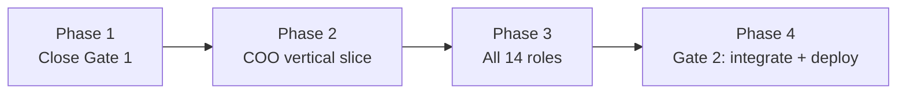

# Orbit — Implementation Plan

**Status:** Proposed plan for team review. Status column values are estimates from branch state on 23 September 2026; each owner should correct their own rows. 
**As of:** 23 September 2026 (`main` at `a60843f`). 
**Related documents:** [PRD](PRD.md) · [Architecture](ARCHITECTURE.md) · [Team assignments](TEAM_ASSIGNMENTS.md) · [File structure](FILE_STRUCTURE.md) · [Decisions](../decisions/).

## 1. Summary

Orbit is between Gate 0 and Gate 1. The repo foundation, the KPI framework import, the auth/session contracts and the API skeleton are merged. Eight decision records (ADRs) are in review, and the backend has draft payload contracts and all six API modules on branches. The database schema, synthetic data, frontend, API modules, CI and deployment have not started.

This plan commits to four phases, in order:

1. **Close Gate 1:** sign off the open ADRs, the entitlement matrix and the contracts; land the core schema.
2. **Build the Regional COO vertical slice:** exception, evidence, guided Ask, action, audit, and a denial for the other region (PRD §5.3).
3. **Extend to all 14 roles:** full dataset, every API module, and all 14 role views.
4. **Pass Gate 2:** deploy both Vercel projects, run the security checklist, the end-to-end smoke test and the demo rehearsal.

No dates are assigned because none were supplied. Phases are sequenced by dependency. Aditya supplies dates and capacity ([TEAM_ASSIGNMENTS §11](TEAM_ASSIGNMENTS.md#11-open-items-this-document-does-not-resolve)).

## 2. Team and ownership

`packages/contracts` is shared: the owner who needs a boundary change authors it, the other side reviews it, and Aditya arbitrates.

| Person | Role | Owns | Produces for others |
|---|---|---|---|
| Aditya | Security, connectivity, integration; decision owner | `docs/decisions/`, CI/deploy config, `.env.example`, cross-boundary review | ADRs, env/secret map, CORS policy, entitlement-matrix sign-off, release go/no-go |
| Maruti | Database and synthetic data | `supabase/`, `packages/data-gen/`, `packages/kpi-framework/`, `data/snapshots/` | Schema + RLS, fixtures and snapshots, framework types |
| Ghansham | Backend (Fastify API) | `services/api/` | API surface, auth/membership/claims pipeline, query needs |
| Ayas | Frontend (React) | `apps/web/`, `packages/ui-kit/` | Design tokens, UI-state needs for contracts, 14 role views |

Aditya's review is required on anything touching contracts, auth, scope, secrets, deploy config or migrations.

## 3. What has been built

From git history and branch contents on `origin`. Only rows marked Merged are on `main`.

| Date | Person | Work | State |
|---|---|---|---|
| 2026-09-23 | Ghansham | Auth/session contracts (PR #5): roles, membership, entitlements, errors, session | Merged |
| 2026-09-23 | Ghansham | API skeleton: JWKS auth, one-active-membership loader, deny-by-default scope, typed errors, exact-origin CORS, `/health`, `GET /api/me`, RLS transaction helpers | Merged with #5; fails closed (503) until the schema exists |
| 2026-09-23 | Ghansham | Lockfile fix (Task 0) | Branch `ghansham/chore-lockfile-sync` |
| 2026-09-23 | Ghansham | Draft payload contracts for brief, inbox, KPI, Ask, actions, audit; `frameworkVersion` on entitlements (ADR 0005) | Branch `ghansham/contracts-payloads-draft`; needs Ayas's review |
| 2026-09-23 | Ghansham | All six API modules behind ports, fail-closed in deployment; 123 API tests pass | Branch `ghansham/api-modules`; SQL ports wait for the schema |
| 2026-09-23 | Ghansham | Subject-only bootstrap transaction for membership reads (ADR 0002 Option A) | Branch `ghansham/api-subject-bootstrap` |
| 2026-09-23 | Maruti | KPI framework import (PR #14): importer, generated 14 roles / 109 assignments / 29 families, 29 tests; ADR 0003 (`exceljs`, `pure-rand`), ADR 0004 (61 reviewed assignment mappings) | Merged; both ADRs still Proposed |
| 2026-09-23 | Aditya | ADRs 0005–0008: entitlement scope, API toolchain + oxlint + Node `>=22.18 <23`, CORS/preview origins, Supabase project (Mumbai, dev/preview) | Separate branches; marked Accepted |
| 2026-09-23 | Aditya | ADRs 0001–0002: credential remediation, membership bootstrap | Branches; Proposed, open items remain |
| 2026-09-23 | Aditya | `orbit` schema + `orbit_app` role migration, ADR 0009 | Branch `aditya/db-roles-bootstrap`; needs Maruti's sign-off (Maruti's path) |
| 2026-09-22 | Aditya | Specifications, file-structure map (#1), Gate 0 monorepo scaffold (#2) | Merged |
| — | Ayas | `apps/web` and `packages/ui-kit` contain only placeholder folders | Not started |

Not yet present anywhere: `.github/workflows` (no CI), Vercel projects, migrations applied to the Supabase project, and any code in `packages/data-gen`.

## 4. Gap analysis

Of the 17 release acceptance criteria in [PRD §9](PRD.md#9-release-acceptance-criteria), only coverage is partly met, through the framework import. The largest gaps are the schema, the generator and the whole frontend.

| Requirement | Spec | Built | Gap | Owner |
|---|---|---|---|---|
| 14 roles, 109 assignments, 29 families | PRD §3.1, §9.1 | Generated package with invariant tests | ADR 0004 mapping sign-off; entitlement matrix content | Maruti, Aditya |
| Identity and scope | PRD FR-01; ARCH §6.1, §8 | Contracts; JWKS verify, membership loader, scope check, RLS helpers (fixture-tested) | Real `org_memberships`/`entitlements` tables; DB leak tests; seeded accounts | Ghansham, Maruti |
| Schema, RLS, grants | ARCH §7.1–7.3 | `orbit_app` bootstrap migration on a branch | Every table, per-operation policies, pgTAP allow/deny tests; Data API disabled | Maruti |
| Synthetic dataset | PRD §8 | Nothing | Fact model, 24 months, 6 hospitals, 9 scenarios, adversarial fixtures, invariants, checksum, plausibility review | Maruti |
| Brief, inbox, explorer | PRD FR-02–04 | Nothing | Payload contracts, `brief`/`inbox`/`kpi` modules, UI features | Ghansham, Ayas |
| Governed Ask | PRD FR-05; ARCH §9 | Nothing | Typed query catalogue, evidence templates, Evidence Card UI, 3+ prompts per role | Ghansham, Ayas |
| Actions and audit | PRD FR-06–07; ARCH §10 | Nothing | Transition matrix, idempotency, optimistic lock, atomic audit write | Ghansham, Maruti |
| UI kit and shell | PRD FR-08; ARCH §5 | Placeholder folders | Tokens, illustrative styles, chart wrappers, login, router, `lib/api.ts` | Ayas |
| 14 role views | PRD §4; ARCH §5 | Placeholder folders | View configs, per-role route tests, 390px/768px/desktop checks | Ayas |
| Deployment and CORS | ARCH §11; ADR 0007 | CORS parsing in API config | Two Vercel projects, Related Projects wiring, auth redirect URLs, preflight tests | Aditya |
| Quality gates | ARCH §15 | Vitest in 3 workspaces; `lint` is a stub | oxlint wiring, CI workflow, secret scan, Playwright + axe smoke | Aditya, all |
| Security checklist | ARCH §16 | 0 of 10 items checked | Credential remediation, legacy key disable, remaining items | Aditya |

## 5. Implementation plan

Each phase ends at a gate. Inside a phase, owners work in parallel against contracts and fixtures. Nobody builds another owner's side of a boundary ([TEAM_ASSIGNMENTS §3.8](TEAM_ASSIGNMENTS.md#3-rules-of-engagement-all-four)).

### Phase 1 — Close Gate 1

**Exit:** contracts v1 signed by all four owners, entitlement matrix signed, core tables exist with RLS tests, CI runs on every PR.

| # | Task | Owner | Needs | Done when | Status |
|---|---|---|---|---|---|
| 0 | Regenerate `package-lock.json` on `main` (currently out of sync; `npm ci` fails) | Aditya or Ghansham | — | `npm ci` succeeds on a clean clone | In review |
| 1 | Finish credential remediation; disable legacy `anon`/`service_role` keys on the new project | Aditya | — | ADR 0001 boxes dated; ADR 0008 §4 met; secret scan clean | In progress |
| 2 | Collect sign-offs and merge ADR branches 0001, 0002, 0005–0009; accept ADR 0003 and 0004 | Aditya | Maruti on 0002, 0009; Ghansham on 0004 | All on `main` with a final status | In review |
| 3 | Decide the seeder role: test whether `bypassrls` is possible on hosted Supabase | Maruti, Aditya | ADR 0009 §2 | Tested option recorded in ADR 0009 | Not started |
| 4 | Fill the entitlement matrix: 109 assignments × grains, breakdowns, evidence fields, actions, audit access | Aditya (signs), Maruti, Ghansham | ADR 0004, ADR 0005 | Reviewed artifact co-signed by Aditya | Not started |
| 5 | Add brief, inbox, KPI, evidence and Ask payload contracts with Ayas; freeze contracts v1 | Ghansham, Ayas | ADR 0005; auth contracts (#5, merged) | Four sign-offs; payloads parse at both ends | In review |
| 6 | UI kit tokens and illustrative styles; shell with login, router and `lib/api.ts` on fixtures | Ayas | Contracts draft | No hard-coded hex; sign-out clears protected state (tested) | Not started |
| 7 | Core migrations: framework, organizations, memberships, entitlements, with grants, RLS and pgTAP; one account per role | Maruti | Tasks 2, 3, 4 | Allow and deny test per table per role passes | Not started |
| 8 | CI workflow: `npm ci`, typecheck, test, oxlint, secret scan; Node `>=22.18 <23` in every workspace | Aditya, each owner | ADR 0006; Task 0 | Required check on PRs to `main` | Not started |
| 9 | Vercel web + API hello-world pair, Related Projects, Supabase redirect URLs; fill ADR 0007 slugs | Aditya | Supabase project (exists) | Web preview calls API preview without hand-edited URLs | In progress |

### Phase 2 — Regional COO vertical slice

**Exit:** [PRD §5.3](PRD.md#53-delivery-strategy-for-a-satisfying-first-release) steps 1–7 pass on a preview deployment against real auth and persisted data.

| # | Task | Owner | Needs | Done when | Status |
|---|---|---|---|---|---|
| 10 | Fact model and generator slice: 2 regions, 6 hospitals, capacity scenario, cross-region fixtures, snapshot checksum | Maruti | Task 7 | Same seed gives an identical snapshot; invariants pass | Not started |
| 11 | Replace fail-closed sources with SQL-backed ones; `brief`, `inbox`, `kpi` endpoints for COO (routes done behind ports); DB claim-leak test | Ghansham | Tasks 5, 7, 10 | Contract tests pass; COO South gets `out_of_scope` | In progress |
| 12 | `actions` + `audit` modules and deterministic Ask catalogue for COO (routes done; transition matrix supplied as a port) | Ghansham | Action transition matrix (Aditya) | Retry and stale-update tests pass; one audit row per action | In progress |
| 13 | Brief, inbox, explorer (components, numerator/denominator), Evidence Card, action form, audit view for COO | Ayas | Tasks 6, 11 | Journey works at 390px, 768px and desktop | Not started |
| 14 | Script the slice smoke test: COO North journey, then COO South denial | Aditya | Tasks 9, 13 | Playwright + axe pass on preview | Not started |

### Phase 3 — All 14 roles

**Exit:** every role has its complete KPI set, one exception-to-action path, three or more guided prompts, and passing allow/deny tests.

| # | Task | Owner | Needs | Done when | Status |
|---|---|---|---|---|---|
| 15 | Full dataset: 24 months, 9 scenarios, adversarial fixtures, plausibility review, `data:seed` / `data:reset`, all-role RLS tests | Maruti | Phase 2 | Invariant suite passes; review recorded per scenario | Not started |
| 16 | All six API modules for all roles; negative tests for 14 roles; ratio roll-ups from numerator/denominator | Ghansham | Task 15 | Contract and authorization suites pass | Not started |
| 17 | 14 role view configs with distinct emphasis; per-role route tests; forbidden, stale and missing-target states | Ayas | Task 16 fixtures | All 109 assignments render from fixtures | Not started |

### Phase 4 — Gate 2, integration and release

**Exit:** all 17 PRD §9 criteria pass on the production pair and Aditya gives go/no-go.

| # | Task | Owner | Needs | Done when | Status |
|---|---|---|---|---|---|
| 18 | Production deploy, CORS preflight tests, ARCH §16 checklist, Playwright + axe smoke, manual keyboard review | Aditya | Phase 3 | All 10 checklist items ticked | Not started |
| 19 | Demo rehearsal per role; confirm with the buyer that v1 is a hosted fictional-data prototype | Aditya, all | Task 18 | PRD §9.12 and §9.17 met | Not started |

## 6. Open decisions and risks

The critical path runs through Aditya's sign-offs and Maruti's schema; the API and frontend both wait on them.

| Item | Owner | Blocks | Risk if late |
|---|---|---|---|
| Entitlement matrix content (109 rows) | Aditya with Maruti, Ghansham | Tasks 4, 7, 11 | API stays fail-closed; no role can see data |
| Seeder role design on hosted Supabase | Maruti, Aditya | Tasks 7, 15 | No safe way to seed without an RLS-bypass credential |
| Action transition matrix | Aditya | Task 12 | The slice cannot record an action |
| Old-key remediation and legacy key disable | Aditya | Task 1, release | A non-rotatable `service_role` key can bypass RLS |
| Does Vercel build `.ts` workspace source and honour `>=22.18 <23`? | Aditya | Task 9 | API deploy fails; unverified per ADR 0006 §4 |
| Ask provider, cost and egress | Aditya with Ghansham | Only a model-backed Ask | None for v1; the deterministic catalogue ships regardless |
| Dates, capacity and estimates | Aditya | Scheduling | Phases have no calendar |
| Buyer alignment: hosted prototype vs. pitch security claims | Aditya | Task 19, any external demo | Demo implies capabilities v1 does not have |

Other risks:

- **Lockfile out of sync on `main`.** `npm ci` fails with vitest, vite, zod and `@fastify/cors` missing from `package-lock.json`. The fix is on `ghansham/chore-lockfile-sync` (Task 0); merge it before CI.
- **Frontend has not started.** Ayas can begin Task 6 now against fixtures; waiting for Gate 1 puts the frontend on the critical path.
- **Branch order matters.** Merge `chore-lockfile-sync`, then `contracts-payloads-draft`, then `api-modules`; `api-subject-bootstrap` is independent but conflicts with `api-modules` on one README table row. `ghansham/contracts-auth-draft` is redundant now that #5 is merged.
- **Local Node versions differ.** `npm run dev` needs `>=22.18 <23`; at least two machines are below that and one is on 26.

## Sources and verification limits

**Verified:** repository contents, git history of `main` and every `origin` branch on 23 September 2026; local `npm run typecheck` and `npm test` on `ghansham/api-subject-bootstrap` (pass, 7 database tests skipped); `npm ci --dry-run` on `main` (fails, lockfile out of sync). 
**Not verified:** GitHub PR states beyond commit messages (the PR list was not readable), Supabase or Vercel project state, and the Status column, which is an estimate.
