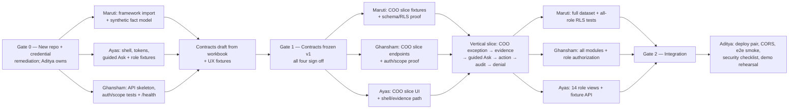

# Orbit — Four-Person Work Assignments

**Status:** Assignment specification for the confirmed four-person team. No code exists yet; this document is the work split, not a report of done work. 
**Related documents:** [PRD](PRD.md) · [Architecture](ARCHITECTURE.md). 
**Team (original split):** Maruti (database/data), Ghansham (backend), Ayas (frontend), Aditya (security/connectivity + integration decision owner).

> **Handover, 2026-10-06.** Ghansham (GitHub `ghanshamrna27`) now builds Orbit alone. From this date:
> - He owns every path below and every review and decision that this document or `AGENTS.md` assigns to any team member, including contracts, authorization, scope, secrets, migrations, source-data rules and instruction files.
> - He runs the hosting: the Vercel projects (`orbit-api`, `orbit-web`, `orbit-erp-web`), the Supabase project and the GitHub Actions schedule.
> - The per-person sections below are kept as the record of the original split, and earlier decisions recorded under a person's name (ADRs, migration comments) stand as written.

## 1. How to read this

Each person gets: mission, owned paths in the new monorepo, deliverables with acceptance criteria, interfaces they produce/consume, dependencies, and a do-not list. Sections reference the architecture doc (`ARCH §n`) and PRD (`PRD §n`) rather than repeating them.

**No dates are assigned.** No timeline was provided, so sequencing is expressed as dependency gates (§4). If Aditya sets dates, add them here — do not invent them.

## 2. Team at a glance

| Person | Mission | Owns (paths in new `orbit/` repo) |
|---|---|---|
| **Maruti** | Fictional company + coherent synthetic data; schema, migrations, RLS, seeds | `supabase/`, `packages/data-gen/`, `packages/kpi-framework/`, `data/snapshots/` |
| **Ghansham** | Fastify backend: all six API modules, auth/scope pipeline, db layer | `services/api/` |
| **Ayas** | React frontend: shell, four surfaces, 14 role views, ui-kit | `apps/web/`, `packages/ui-kit/` |
| **Aditya** | Security + connectivity: auth verification, CORS, Vercel/Supabase projects, secrets, integration review | `docs/decisions/`, CI/deploy config, `.env.example`, cross-boundary reviews |

`packages/contracts/` is **shared**: whoever needs a boundary change authors it, the boundary's other side reviews it, Aditya arbitrates. Nobody merges a contract change unilaterally. (Since 2026-10-06 Ghansham holds all of these roles; see the handover note.)

## 3. Rules of engagement (all four)

1. New repo, branch `<name>/<what>` (e.g. `maruti/schema-core`). Never push to `main`; PR + review from the owner on the other side of every boundary touched.
2. Cross-module shapes exist only in `packages/contracts`. Parse, never cast. Missing field → contracts PR, not a local type.
3. No invented data, thresholds, KPI names, or facility names in source — they come from Maruti's generator output and `packages/kpi-framework`.
4. Every number surface keeps illustrative disclosure (`.is-illustrative`, `disclosure` string). Never removed for screenshots.
5. Role/scope come from the verified token + membership record, never from a request or UI state.
6. Before every push: `npm run typecheck && npm run test && npm run lint` (+ `supabase test db` in CI where a Docker-compatible Supabase CLI runtime is available, or an equivalent approved remote RLS test environment, when migrations changed). Docker is optional for local development; hosted Supabase plus fixtures is the default MVP workflow.
7. When you finish a task, state for each boundary you touched whether you **verified** it against the other side's actual code or **assumed** it. Labelled assumptions are required in every PR description.
8. If you need something from another person's module that doesn't exist, build against the contract + fixtures, and flag it as unverified — don't build their side.

## 4. Dependency gates (sequencing)

- **Gate 0** is limited to the new repository foundation and urgent credential remediation. Cloud deployment is not a prerequisite for local fixture work.
- The workbook already fixes the framework shape, so Maruti's generator and Ayas/Ghansham fixture work begin in parallel. The workbook does not fully determine API response payloads; those are drafted from both the workbook and UX needs.
- **Gate 1** freezes cross-module contracts after all four owners review them.
- The first integrated deliverable is one complete Regional COO workflow. The remaining 13 roles then extend the same proven interaction model through role configuration and scenario coverage.

## 5. Maruti — database and data

**Mission:** one fictional healthcare group whose numbers reconcile, exposed through a schema where authorization is enforced by construction, and reproducible on any machine.

**Deliverables and acceptance criteria:**

1. **`packages/kpi-framework` import.** Generated (not hand-copied) from the workbook: 14 roles, 109 assignments with weights summing to 100 per role, 29 definition families, definitions/target-basis/review/source columns, version stamp + checksum. *Accepts when:* a test fails if any of those counts or any row mapping drifts from the workbook; unresolved compound-metric decompositions are flagged `unresolved`, never faked.
2. **Schema migrations** per ARCH §7.1. *Accepts when:* every migration carries its grants + RLS in the same file; pgTAP through `supabase test db` (or the approved remote equivalent) passes an allow **and** deny test per table per role; no `USING(true)`; no security-definer view over protected tables; audit table has no UPDATE/DELETE grant to anyone.
3. **Membership + entitlement seed** implementing the matrix (ARCH §8.2). *Accepts when:* at least one provisioned account per role, second accounts for region/facility isolation, plus a second test organization; the matrix itself is a reviewed artifact co-signed by Aditya.
4. **Deterministic generator** per PRD §8: facts first, derived KPIs, 24 months, 2 regions/6 hospitals/COE structure, the nine labelled scenarios, adversarial fixtures (cross-region, cross-org, missing denominator, stale, unapproved target). *Accepts when:* same seed → byte-identical snapshots + matching checksum in CI; invariant suite passes (reconciliation, roll-ups, missing≠zero, unit/dimension validity, no double-counted COE/corporate segments); the clinical/operational plausibility review in PRD §8.2 is recorded for every demo scenario.
5. **Seed/reset tooling** per ARCH §7.5: environment-restricted, idempotent seed; explicit separate reset. *Accepts when:* an approved dev/test Supabase (local CLI when Docker is available, otherwise a dedicated remote project) goes from empty to fully seeded demo with two documented commands, using only env-provided credentials.

**Interfaces produced:** schema + RLS (→ Ghansham), fixtures + snapshot JSON (→ Ghansham, Ayas), framework package types (→ all), disclosure/data-quality fields (→ Ayas via contracts).

**Depends on:** the new repository foundation (Gate 0); entitlement matrix sign-off (with Aditya/Ghansham) before seeded authorization fixtures; Aditya's answers on currency/fiscal calendar if he wants anything other than the fictional defaults Maruti proposes. Workbook import and fact-model work do not wait for hosted Supabase.

**Do not:** commit any credential (the old remote seed script is the anti-pattern — that key's rotation is tracked in §8); invent clinical thresholds or client-approved targets; hand-edit generated framework files; treat workbook section headings as outcomes.

## 6. Ghansham — backend

**Mission:** the only path to business data — a Fastify API where every request is authenticated, authorized against entitlements, executed under RLS, and parsed against contracts.

**Deliverables and acceptance criteria:**

1. **App skeleton + request pipeline** (ARCH §6.1): `src/app.ts` entrypoint, auth plugin (JWKS verify via `jose`, iss/aud/exp), membership loader, scope plugin, typed errors incl. `out_of_scope`. *Accepts when:* requests with no token, expired token, forged claims, unknown user, inactive membership, and ambiguous membership each return the specified denial; a test proves role is never read from request data.
2. **db layer** (ARCH §6.3): pooler transaction mode, `orbit_app` role, per-transaction `SET LOCAL` claims, connections closed per invocation. *Accepts when:* an integration test shows RLS filtering changes with the injected membership, and a leak test shows claims never persist across requests on the pooled connection.
3. **Modules `brief`, `inbox`, `kpi`:** serve every authorized assignment with components, trend, lineage, provenance, disclosure; explicit missing-target/denominator/stale states. *Accepts when:* contract tests pass per endpoint; ratio roll-ups come from numerator/denominator aggregation (tested); out-of-scope probes per role return `out_of_scope` (negative tests for all 14 roles).
4. **Module `actions` + `audit`:** state machine, idempotency, optimistic locking, atomic audit write. *Accepts when:* concurrent-update and retry tests pass; an action survives API redeploy with exactly one audit trail.
5. **Module `ask`:** deterministic typed-query catalogue with evidence templates (PRD FR-05); model adapter stubbed behind config. *Accepts when:* every role has guided prompts and answers render the Evidence Card sections; answers carry scope/period/evidence/limitations; scope-escalation attempts are refused; tests prove no arbitrary SQL path exists.
6. **Deployability:** boots under `vercel dev`, respects ARCH §11.4 limits. *Accepts when:* the deployed preview passes Aditya's smoke checklist (§15 of ARCH).

**Interfaces produced:** API surface (→ Ayas via contracts), auth/membership/claims contract (→ Aditya reviews), query requirements (→ Maruti schema).

**Depends on:** contracts draft/fixtures (can begin before Gate 1), Maruti's schema + fixtures for full integration, and Aditya's JWKS/CORS/env config before deployment. Auth and scope logic can be tested locally or against a dedicated test boundary; `supabase start` requires a Docker-compatible runtime and is not assumed because Docker is not in the pinned local stack. The supported MVP path is hosted dev/preview Supabase plus fixtures, with linked migrations.

**Do not:** add an ORM, a second framework, or arbitrary user SQL; cache protected data in process memory; log tokens or secrets; silently narrow results instead of answering `out_of_scope`.

## 7. Ayas — frontend

**Mission:** one app that makes 14 genuinely different roles feel considered — four working surfaces per role, with disclosure and failure states treated as first-class.

**Deliverables and acceptance criteria:**

1. **`packages/ui-kit`:** tokens (palette/type/space/radius), illustrative chips/styles, chart wrappers (only place Recharts is imported), and any selectively adopted Radix primitives. *Accepts when:* the design-guideline bans pass by construction — no hard-coded hex, more than one typeface in real use, no library-default chart styling; Radix wrappers expose Orbit styling and tested focus/keyboard behavior rather than library defaults.
2. **Shell:** login (Supabase `signInWithPassword`, no signup), React Router v7 data-router setup (loaders/actions/fetchers/pending/error states), session lifecycle, typed API client with contracts parsing. *Accepts when:* sign-out/token-change clears protected state (tested); every API failure mode renders its specified state; no component calls `fetch` directly.
3. **Four features:** brief, inbox, explorer, ask (plus actions/audit views where permitted), driven entirely by API data + role view configs. *Accepts when:* no KPI name, target, or facility name is hard-coded; explorer renders component measures and lineage rather than flattened composites; Ask renders guided prompts and the structured Evidence Card; illustrative disclosure is visible on every number surface.
4. **14 role views** under `src/roles/*`: distinct emphasis and layouts per role's KPI shape. *Accepts when:* a route-level test per role renders its complete workbook KPI set from fixtures (7/8/9 assignments as applicable — all 109 across roles); brief/inbox tests pass at 390px, 768px, and desktop widths; forbidden and out-of-scope states are tested, not just happy paths; a small Playwright + `@axe-core/playwright` smoke suite covers the Regional COO journey and core responsive viewports, with manual keyboard review recorded separately.
5. **Deployability:** builds as a static Vite app on Vercel project 1 with SPA rewrite. *Accepts when:* the preview deployment passes the same smoke checklist against the preview API.

**Interfaces produced:** UI-state expectations (→ contracts reviews), view-config typing (→ `kpi-framework` consumers), copy/label needs for disclosure states.
**Depends on:** ui-kit tokens (own Gate 0 work), contract fixtures before Gate 1, Ghansham's fixture-backed endpoints for integration, and Aditya's auth/redirect config before deployment. Ayas does not wait for a live backend to build the role configurations.

**Do not:** import Recharts outside ui-kit; add a styled component library, second accessibility abstraction, or state-management library; build role switching/impersonation UI; hard-code hexes, KPI content, or "polish away" illustrative labelling; call `fetch` outside `lib/api.ts`.

## 8. Aditya — security, connectivity, integration

> Since 2026-10-06 this section's work, including Vercel, Supabase and review sign-off, sits with Ghansham (see the handover note at the top). It is kept as the record of the original split.

**Mission:** make the boundaries real — verified identity, locked-down data access, two Vercel projects that actually talk to each other, and no secrets where they shouldn't be.

**Deliverables and acceptance criteria:**

1. **Urgent: credential remediation.** The old remote repo contains a hard-coded Supabase service-role credential in its seed script (found during research; never used by anyone on this team). *Accepts when:* the key is revoked/rotated in that Supabase project, a history-scrub decision is recorded in `docs/decisions/`, and a repo/CI secret scan passes. This is first, before any new build.
2. **Repo + cloud foundations (Gate 0):** new monorepo scaffold with root scripts; two Vercel projects wired to it with root directories, skip-unaffected-builds verified, Related Projects preview wiring; dev + prod Supabase projects (asymmetric JWT signing keys confirmed); `.env.example` documenting every variable. *Accepts when:* a trivial hello-world of both projects deploys and the web preview calls the api preview without hand-edited URLs.
3. **Auth/redirect/CORS configuration** (ARCH §11.3): Site URL, redirect allowlist incl. localhost + Vercel preview wildcard, exact-origin CORS on the API. *Accepts when:* sign-in works on production and a preview; preflight from an unapproved origin fails (tested, not assumed).
4. **Entitlement matrix ownership:** drafted with Maruti/Ghansham, signed off by you before Gate 1-dependent work. Same for the action transition matrix and the Ask provider decision (default: deterministic catalogue ships regardless).
5. **Security review + e2e smoke ownership:** ARCH §16 checklist executed item by item on the integrated system; the four-surface demo path rehearsed per role; Playwright/axe post-deploy smoke (§15) and manual keyboard review owned by you until the team has automated and reviewed the required coverage.
6. **Decision log:** every open decision from PRD §10 / ARCH §17 resolved as a short ADR in `docs/decisions/`.

**Interfaces produced:** env/secret map (→ all), CORS/origin policy (→ Ghansham), auth redirect config (→ Ayas), membership/claims review (→ Ghansham/Maruti), release go/no-go.

**Depends on:** everyone's contract and vertical-slice output for final integration; only the new repository foundation and credential remediation block Gate 0. Cloud project wiring can proceed in parallel with the other three owners' local fixture work.

**Do not:** store secrets in the repo, `VITE_*`, tickets, or chat; disable a security control to make a demo deadline — reduce scope instead; merge boundary PRs without the counterpart review.

## 9. Interface contracts between pairs

The original split is below. Since 2026-10-06 Ghansham produces and reviews every boundary; each boundary is still verified against the other side's actual code before merge (§10).

| Boundary | Producer → Consumer | Frozen at | Reviewer |
|---|---|---|---|
| API payloads | Ghansham → Ayas (and back) | contracts v1, Gate 1 | Aditya |
| Schema/query needs | Maruti ↔ Ghansham | Gate 1, iterated by PR | Aditya |
| Fixtures/snapshots | Maruti → Ghansham, Ayas | Gate 1, versioned by checksum | consuming owner |
| Membership/claims shape | Aditya + Ghansham → Maruti (RLS) | Gate 1 | Aditya |
| Design tokens | Ayas → everyone visual | Gate 0 | Aditya (guidelines) |
| Env vars/secrets | Aditya → all | Gate 0, append-only changes | all affected |
| Workbook truth | Maruti (`kpi-framework`) → all | Gate 1 | Aditya |

## 10. Definition of done (any task)

1. Root gates pass (`typecheck`, `test`, `lint`; plus `supabase test db` for data changes).
2. Contracts parse at both ends of every boundary touched.
3. Negative tests exist where authorization is involved.
4. Illustrative disclosure intact on any new number surface.
5. PR description lists each boundary as **verified** (against the other side's actual code/deploy) or **assumed** — silent assumptions are a defect.
6. Review from Ghansham, the sole owner since 2026-10-06 (before that: the boundary owner, and Aditya on anything touching auth, scope, secrets, or deploy config).

## 11. Open items this document does not resolve

- Dates, capacity, and time estimates — Ghansham to supply; gates above are the sequencing meanwhile.
- Ask provider/cost/egress (v1 unaffected — deterministic catalogue).
- Action transition matrix and any future outbound notification.
- Domains, regions, plan tiers, performance envelope sign-off.
- Real-data pilot questions (jurisdiction, residency, clinical validation) — out of scope for this release, must be named before any real data is discussed.

## Sources

Assignments derive from [PRD](PRD.md) (scope, data brief, acceptance criteria) and [ARCHITECTURE](ARCHITECTURE.md) (layout, security, deployment, vendor-cited constraints). Workbook row/family counts verified by direct inspection of `Africare_Group_KPI_Framework.xlsx`; reuse/reject verdicts verified by inspection of local `63f0fcb` and remote `81cc292`. Nothing here has been verified as running software — verification is the work assigned above.
